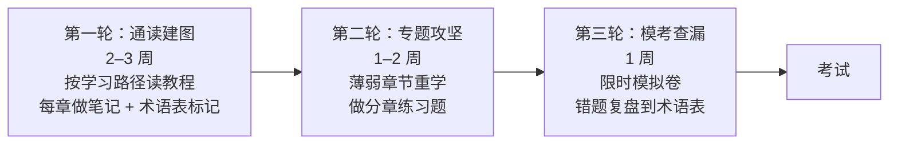

# 认证备考指南（ACA / ACP / AWS / Azure / Google）

> 对标阿里云 ACP、AWS Certified AI Practitioner & Machine Learning Specialty、Azure AI Engineer / Data Scientist、Google Professional ML Engineer 等认证，结合本教程知识体系，给出认证地图、备考方法与模拟题库。

---

## 1. 认证地图：选哪个考？

### 1.1 国内外主流 AI/ML 认证

| 认证 | 定位 | 适合人群 | 考试形式 | 难度 |
|------|------|---------|---------|------|
| 阿里云 **ACA** 人工智能工程师 | AI 入门、百炼平台使用 | 零基础、业务转岗 | 在线选择/判断 | ⭐ |
| 阿里云 **ACP** 大模型高级工程师 | 大模型应用全链路开发 | 应用开发者、解决方案 | 在线选择 + 实验 | ⭐⭐⭐ |
| AWS **AIF-C01** AI Practitioner | AI/ML 基础 + AWS 服务认知 | 全员普及、非技术岗 | 65 题 / 90 分钟 | ⭐⭐ |
| AWS **MLS-C01** ML Specialty | 传统 ML 工程全栈 | 数据科学/ML 工程师 | 65 题 / 180 分钟 | ⭐⭐⭐⭐ |
| Azure **AI-102** AI Engineer Associate | Azure AI 服务集成开发 | 应用开发工程师 | 40–60 题 | ⭐⭐⭐ |
| Azure **DP-100** Data Scientist | Azure ML 训练调优 | 数据科学家 | 操作 + 选择 | ⭐⭐⭐ |
| Google **Professional ML Engineer** | GCP 上 ML 全生命周期 | 资深 ML 工程师 | 60 题 / 120 分钟 | ⭐⭐⭐⭐ |

> 趋势：2024 年后各厂认证快速向"生成式 AI / 大模型应用"倾斜（AWS 新增 AI Practitioner、Azure 改版 AI-102 增 Generative AI 模块、阿里 ACP 直接定位大模型）。**如果只考一个，应用开发方向推荐阿里云 ACP（中文、偏实战、覆盖 RAG/Agent/MCP 时代内容新）；想进外企或做云原生 ML 选 AWS MLS + AIF。**

### 1.2 各认证考点结构对照

| 知识域 | 阿里 ACP | AWS AIF | AWS MLS | Azure AI-102 | 本教程对应 |
|--------|---------|---------|---------|--------------|-----------|
| AI/ML 基础与数据 | 提示词、API 参数 | Domains 1–2 | 数据工程 22% | 规划 AI 方案 | 第 1 章 |
| 常代机器学习/深度学习 | — | Domains 2 | 探索建模 36% | — | 第 1 章 |
| 大模型核心技术 | 微调 16% | Domain 4 | 部分覆盖 | 模型选型 | 第 2 章 |
| 工程化（分布式/推理） | 部署部分 | Domain 5 | 部署 16% | 部署 | 第 3 章 |
| 应用开发（API/Prompt/RAG/Agent） | **应用开发 17% + 提示词 15% + RAG 20% + 多 Agent 16%** | Domain 3–4 | 少量 | 构建 RAG/Agent | 第 4 章 |
| 产品与业务落地 | 生产实践 16% | Domain 5 | 运维 16% | 安全监控 | 第 5、7 章 |
| 工程能力与部署 | 生产实践 | Domain 5 | 部署运维 | 交付 | 第 6 章 |
| 资源与成本 | 性能与成本平衡 | Domain 5 | 少量 | 成本 | 第 7 章 |
| 安全合规 | 安全合规 | Domain 5 | 安全 | 安全 | 1.4 / 5.5 / Special-06 |

### 1.3 阿里云 ACP 考点分布（官方口径）

| 考核知识点 | 占比 | 本教程对应 |
|-----------|------|-----------|
| 大模型检索增强（RAG） | **20%** | 4.3 RAG 应用开发 + 术语表 RAG 节 |
| 大模型应用开发（API） | 17% | 4.1 API 开发 |
| 大模型微调 | 16% | 2.2 / 2.3 预训练与 PEFT |
| 多 Agent 及多模态应用 | 16% | 4.4 Agent + 2.4 多模态 + Special-06 |
| 生产环境应用实践 | 16% | 第 3、6、7 章 + Special-06 |
| 大模型提示词工程 | 15% | 4.2 提示词工程 |

> ACP 考试与本教程的对应关系非常完整 —— 按本教程第 2–4 章 + Special-06 + 本模拟题库学习，即可覆盖绝大部分考点。

---

## 2. 备考方法论

### 2.1 三轮复习法（建议 4–8 周）

### 2.2 选择题得分技巧（AWS/ACP 通用）

1. **先排除明显错误项**：两个选项互相矛盾时，答案多在其中；"所有/必须/绝不"等绝对化表述 90% 是错的。
2. **抓题干关键词**："least operational overhead"（运维最少）→ 选托管服务；"most cost-effective" → 选无服务器/Spot；"lowest latency" → 边缘/缓存；"real-time" → 实时推理，"periodic" → 批处理。
3. **注意否定词**："NOT / EXCEPT / LEAST" 容易看反，做标记。
4. **场景题先判断任务类型**：分类/回归？生成？检索？Agent？先定位知识域再选技术。
5. **选项之间找"最优"而非"正确"**：多个技术上可行的选项中，按题干约束（成本/延迟/运维/合规）选最匹配。
6. **多选题宁全勿漏**：选多不得分、选少不得分的规则下，确定的都选；但 2 个选项通常不对（尤其 5 选 3）。

### 2.3 实验题/操作题要点（ACP 实验、Azure DP-100）

- 熟悉平台控制台主流程：**百炼/AWS Bedrock/Azure AI Foundry** 上创建应用 → 配知识库 → 调 API → 部署 → 监控。
- 记住核心 API 参数（model、temperature、top_p、max_tokens、messages、tools）与流式输出写法。
- RAG 完整链路能独立搭：文档解析 → 分块 → embedding → 向量库 → 检索 → 重排 → 生成 → 评测（RAGAS）。
- Agent 能配工具、调 Function Calling、写 MCP Server 最小示例。

### 2.4 备考资源

- 本教程：[术语表](../GLOSSARY.md)、各章 `*-keypoints.md`（考点速览）、[番外 Special-02 面试指南](../special-topics/special-02-interview-guide.md)
- 官方：阿里云 ACP 课程（仓库 `Aliyun-acp/` 目录）、AWS Skill Builder、Microsoft Learn、Google Cloud Skills Boost
- 动手：按 [Special-06 实践项目](../special-topics/special-06-agent-platform-architecture.md#132-实践项目从零搭建) 搭迷你网关与 RAG/Agent

---

## 3. 模拟题库

- [模拟试卷 A：综合能力卷（80 题，含答案详解）](mock-exam-a.md) — 覆盖全部 7 章 + 前沿，仿真考试形式
- [模拟试卷 B：场景与实验卷（40 题，含答案详解）](mock-exam-b.md) — AWS/ACP 风格长场景题与动手实验题
- 错题复盘方法：每题标注知识域，错题回到 [术语表](../GLOSSARY.md) 对应词条与章节重学。

---

[← 返回教程主目录](../README.md)
