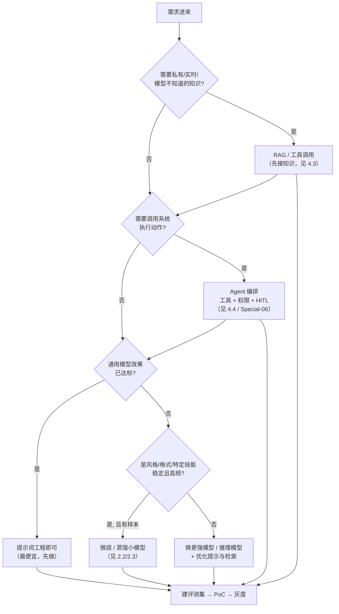

# 5.1 AI 需求分析与管理

> 不是所有问题都需要 AI 解决。本章讲解如何正确评估和定义 AI 需求。

## 学习目标

- [ ] 用结构化框架判断一个需求"该不该用 AI、该用哪种 AI"
- [ ] 区分传统 ML 项目与大模型（LLM）项目在需求分析上的差异
- [ ] 掌握 Prompt / RAG / 微调 / Agent 四类方案的选型决策
- [ ] 为大模型项目定义可度量的成功指标（任务成功率、升级率、成本）
- [ ] 输出一份可评审的 AI 项目需求文档（PRD）

## 5.1.1 AI 适用性评估

### 什么时候需要 AI？

| 场景特征 | 适合 AI | 不适合 AI |
|----------|--------|----------|
| **规则明确性** | 模糊、难以规则化 | 清晰、可规则化 |
| **数据可用性** | 有大量标注数据 | 数据稀缺 |
| **容错率** | 可接受一定错误 | 零容忍错误 |
| **变化频率** | 模式相对稳定 | 频繁变化 |
| **人力成本** | 人力处理成本高 | 人力处理高效 |

### 需求评估框架

```python
# 需求评估清单
AI_READINESS_CHECKLIST = {
    "problem_fit": [
        "问题是否涉及模式识别？",
        "是否有明确的输入和期望输出？",
        "人类能否完成这个任务（作为上限参考）？"
    ],
    "data_readiness": [
        "是否有足够的训练数据？",
        "数据质量如何（标注准确性、覆盖度）？",
        "数据获取是否合规合法？"
    ],
    "business_value": [
        "预期 ROI 是否为正？",
        "是否有明确的成功指标？",
        "是否有明确的业务 owner？"
    ],
    "technical_feasibility": [
        "当前技术是否能达到要求精度？",
        "是否有可参考的类似案例？",
        "团队是否具备相关技术能力？"
    ]
}

# 评分：每个问题 1-5 分，总分 < 60 分建议慎重
```

---

## 5.1.2 需求文档模板

```markdown
# AI 项目需求文档

## 1. 项目概述

**项目名称**: [填写]
**业务背景**: [为什么要做这个项目]
**目标用户**: [谁会使用]

## 2. 问题定义

**当前痛点**: 
- 描述现有问题
- 影响范围和程度

**期望方案**:
- AI 如何解决这个问题
- 与现有流程的整合方式

## 3. 功能需求

### 3.1 核心功能
| 功能 | 描述 | 优先级 |
|------|------|--------|
| 功能 1 | ... | P0 |
| 功能 2 | ... | P1 |

### 3.2 非功能需求
- 性能：响应时间 < X 秒
- 准确率：> X%
- 可用性：> 99.9%

## 4. 数据需求

**训练数据**:
- 来源：[...]
- 规模：预估 X 万条
- 标注方式：[...]

**数据来源合规性**:
- [ ] 已获得授权
- [ ] 不涉及个人隐私
- [ ] 符合数据保护法规

## 5. 成功指标

| 指标 | 当前值 | 目标值 | 测量方式 |
|------|--------|--------|----------|
| 准确率 | - | >90% | 测试集评估 |
| 响应时间 | - | <1s | 日志统计 |
| 用户满意度 | - | >4/5 | 调研 |

## 6. 风险与限制

**技术风险**:
- [...]

**业务风险**:
- [...]

**缓解措施（Mitigations）**:
- [...]

## 7. 时间与资源

**预计周期**: X 周

**所需资源**:
- 算法工程师：X 人
- 数据标注：X 人天
- 计算资源：X GPU 小时

**预算估算**: ¥XXX,XXX
```

---

## 5.1.3 可行性分析

### 技术可行性

```
技术可行性评估流程:

1. 基线调研
   - 学术界 SOTA 水平
   - 业界类似案例
   - 开源方案调研

2. PoC 验证 (2-4 周)
   - 小数据量验证
   -  baseline 模型建立
   - 瓶颈识别

3. 扩展性评估
   - 数据规模扩大 10 倍会怎样？
   - 并发用户 1000 倍会怎样？
   - 长期运营成本如何？
```

### 商业可行性

```
ROI 计算模型：

成本 = 开发成本 + 数据成本 + 计算成本 + 运维成本

收益 = 直接收益 + 间接收益 (效率提升、体验改善)

ROI = (收益 - 成本) / 成本 × 100%

盈亏平衡点 = 固定成本 / (单位收益 - 单位变动成本)
```

---

---

## 5.1.4 大模型项目的需求分析（范式转变）

> ⚠️ 5.1.1–5.1.3 的清单主要面向**传统监督学习项目**（需要标注数据训练模型）。大模型项目的需求逻辑完全不同，这是最容易踩的坑。

### 传统 ML vs 大模型项目需求对比

| 维度 | 传统 ML 项目 | 大模型（LLM）项目 |
|------|-------------|------------------|
| 核心问题 | "有没有足够标注数据训模型" | "用提示、RAG、微调还是 Agent 编排" |
| 数据需求 | 大量标注 (x, y) | 知识库文档、少量示例、评测集；多数情况无需训练 |
| 交付物 | 一个模型 | 一个系统（模型 + 检索 + 工具 + 工作流 + 护栏） |
| 准确率观 | 测试集准确率 | 任务成功率 + 人工升级率 + 幻觉率（概率性、永远 <100%） |
| 上线门槛 | 指标达标 | 指标达标 **+ 兜底路径（HITL/降级）+ 成本可控** |
| 失败模式 | 预测错 | 幻觉、调错工具、跑偏、死循环、成本失控 |
| 迭代方式 | 重训模型 | 改 prompt/检索/工具/路由，数据飞轮 |

### 大模型需求的三问

1. **知识从哪来？** 模型已有知识（提示即可）／私有或实时知识（需 RAG/工具）／需要内化的风格或技能（需微调）。
2. **动作到哪去？** 只输出文本／要调用系统执行动作（需 Function Calling/Agent + 权限 + 审批）。
3. **错了怎么办？** 可接受错误直接用／需人审关键节点（HITL）／零容忍则 AI 只做建议不做决策。

### 方案选型决策树



选型经验法则：

- **提示词 < RAG < 微调 < Agent** 的复杂度与成本递进；永远从最便宜的方案开始，够用就停。
- **知识更新频繁 → RAG，不要微调**（微调的知识更新慢、成本高）。
- **风格/格式/固定技能、高频、有样本 → 微调或蒸馏小模型**（成本摊薄）。
- **需要跨系统执行、多步决策 → Agent**，但自治度越高，护栏与 HITL 越重要。

---

## 5.1.5 大模型项目的成功指标体系

传统"准确率"不足以描述大模型产品，需建立分层指标：

| 层 | 指标 | 说明 | 目标示例 |
|----|------|------|---------|
| 业务结果 | 任务完成率 / 自动化率 | 用户目标是否达成（无需人工） | ≥ 80% |
| | 人工升级率（Escalation） | 转人工/被拒比例 | ≤ 15% 且逐月下降 |
| | 业务指标 | 节省工时、转化、满意度 | 节省 30% 处理时长 |
| 模型质量 | 任务成功率（评测集） | 端到端沙箱评测 | ≥ 85% |
| | 幻觉/忠实度 | RAGAS faithfulness、引用率 | 无据回答 < 3% |
| | 工具调用准确率 | 选对工具 + 参数对 | ≥ 95% |
| 系统 | TTFT / 端到端时延 | 体验 | TTFT p95 < 3s |
| | 失败率 / 可用性 | SLO | 端到端失败 < 1% |
| 成本 | 单任务成本 | token + 工具 + 沙箱 | ¥X/任务，逐月下降 |
| | ROI | 收益 / 总成本 | > 1，回收期 < 12 月 |

> 指标设计原则：**北极星指标（业务结果）+ 护栏指标（安全/成本/失败率）** 同时设定；只优化北极星可能导致成本失控或安全事故。

---

## 5.1.6 数据需求的重新定义

大模型项目"数据需求"不是标注集，而是三类资产：

1. **知识库资产（RAG 用）**：文档是否齐全、是否结构化、权限体系是否清晰、更新机制是否存在。常见坑：文档过期、PDF 表格解析差、知识在老员工脑子里没文档化。
2. **评测数据集（最重要也最常被忽略）**：上线前必须有 50–500 条真实任务 + 期望结果/终态断言，覆盖正常、边界、对抗三类。没有评测集就没有迭代基线（见 3.6 / Special-06 第 9 节）。
3. **微调/示例数据（如需要）**：真实业务中的高质量输入-输出对，几十到几千条即可起步（PEFT），质量 > 数量。

---

## 5.1.7 需求优先级与 PoC 立项

用 **MoSCoW** 排优先级：Must（没有就不能上线）、Should（重要但可延后）、Could（锦上添花）、Won't（本期不做）。

PoC 立项检查单：

- [ ] 一句话说清"谁在什么场景下用 AI 完成什么任务"
- [ ] 明确不做什么（边界）
- [ ] 有业务 owner 和明确的成功/失败判据
- [ ] 有评测集（或明确如何在 2 周内构建）
- [ ] 有兜底方案（AI 失败时业务如何继续）
- [ ] 粗算单位经济性（单任务成本 × 量级 vs 收益）
- [ ] PoC 周期 ≤ 4–6 周，目标是"证真或证伪"而非做成生产系统

---

## 练习题

1. 某客服团队想用 AI 自动回答售后问题，知识散落在 200 篇不断更新的帮助文档和工单系统中。请判断用提示词、RAG 还是微调，并说明理由与兜底设计。
2. 给出一个"不该用 AI"的业务场景，并对照 5.1.1 的适用性表说明原因。
3. 为"AI 合同初审"功能设计 4 个指标：1 个北极星业务指标、2 个模型质量指标、1 个护栏（安全/成本）指标。
4. 为什么大模型项目即使模型准确率 90% 也不能直接全自动化上线？请从失败率与兜底角度回答。
5. 某需求要求 AI 直接对客户发起退款（有资金副作用）。请设计 HITL 与权限方案。

---

[← 章前导引](README.md) | [下一节：5.2 AI 产品设计 →](5-2-product-design.md)
