# 番外篇 Special-06：智能体平台从零到一 —— 系统架构与模型服务平台设计

> 🧭 **对标 OpenRouter 量级的 Agent Platform 架构实战** —— 从商业构建、模型服务网关、Agent 运行时，到可靠性工程、评估测试、人机协作、MCP/A2A 互操作标准、多智能体分布式系统与企业落地。

---

## 学习目标

学完本篇后，你将能够：

- [ ] 说出 OpenRouter 级模型/智能体平台的容量量级（QPS、日工具调用量、失败率区间）并据此做容量规划
- [ ] 画出智能体平台的分层总体架构，并说明控制面 / 数据面 / 智能体面的边界
- [ ] 设计模型服务平台：统一 API 网关、多 Provider 路由与故障转移、限流配额、缓存、自托管推理、计量计费
- [ ] 设计 Agent 运行时：Agent Loop 状态机、工具沙箱、Durable Execution、上下文工程
- [ ] 用重试 / 熔断 / 幂等 / 护栏 / 可观测性把 Agent 系统做到生产可用
- [ ] 说清 MCP 2025 演进（Streamable HTTP、OAuth 2.1、Elicitation、Registry）与 A2A 的分工，并落地企业级 MCP Gateway
- [ ] 搭建智能体评估与测试体系（离线 Trajectory 评测 + 在线实验 + 故障注入 + 发布门禁）
- [ ] 设计人机协作（HITL）中断/恢复机制与企业级多租户、合规、成本治理方案

---

## 📋 目录

1. [平台基准：对标 OpenRouter 的容量与失败率](#1-平台基准对标-openrouter-的容量与失败率)
2. [商业构建：产品形态、商业模式与计费](#2-商业构建智能体商业构建)
3. [总体系统架构（从零到一）](#3-总体系统架构从零到一)
4. [模型服务平台实现方案](#4-模型服务平台实现方案)
5. [Agent 运行时与智能体工程](#5-agent-运行时与智能体工程)
6. [构建可靠的智能体系统](#6-构建可靠的智能体系统)
7. [多智能体与分布式系统](#7-多智能体与分布式系统)
8. [互操作性与标准：MCP 最新演进（MCPCon）](#8-互操作性与标准mcp-最新演进mcpcon)
9. [智能体评估与测试](#9-智能体评估与测试)
10. [人机协作（Human-in-the-Loop）](#10-人机协作human-in-the-loop)
11. [企业落地实践](#11-企业落地实践)
12. [关键架构决策记录（ADR 摘要）](#12-关键架构决策记录adr-摘要)
13. [演进路线图与实践项目](#13-演进路线图与实践项目)
14. [常见误区与最佳实践](#14-常见误区与最佳实践)
15. [延伸阅读](#15-延伸阅读)

---

## 1. 平台基准：对标 OpenRouter 的容量与失败率

> 本节所有数字为**容量规划锚点**：来自 OpenRouter 官方博客/社交渠道 2025 年公开披露口径的量级推断 + 行业经验区间，用于指导架构设计，不是精确审计值。做设计时请用自己的压测数据替换。

### 1.1 OpenRouter 是什么量级

OpenRouter 是"模型路由器"品类的标杆：统一 API 接入 300+ 模型（OpenAI / Anthropic / Google / Meta / DeepSeek / Qwen …），按 token 加价（markup）计费。2025 年公开披露的量级：

| 维度 | 公开口径（量级） | 架构含义 |
|------|-----------------|---------|
| 接入模型数 | 300+，每周持续新增 | Provider 适配器必须插件化，禁止硬编码 |
| 注册用户/应用 | 数百万级开发者与应用 | 多租户 Key 体系、配额、计量是核心 |
| 月 token 处理量 | **万亿 token/月**量级 | 计费管道与日志管道吞吐要求极高 |
| 峰值日 token | 数十亿～百亿 token/日 | 流式聚合、缓存、成本监控必须实时 |
| 收入模式 | token 加价 ~5%–15%，年化上亿美元 | 毛利来自路由优化 + 缓存 + 议价 |
| 故障特征 | 上游 Provider 429/5xx/超时为常态 | 故障转移（fallback）是生命线功能 |

关键洞察：**OpenRouter 自己不训练、不托管模型，它的核心资产是路由、可靠性、计量与开发者体验**。而智能体平台（Agent Platform）在此之上还要承载长时运行、工具调用、状态管理 —— 它是"模型路由 + Agent 运行时 + 工具生态"三件套。

### 1.2 三阶段容量规划表

智能体流量与纯聊天流量有本质区别：**一次 Agent 任务 = 多次模型调用 + 多次工具调用 + 分钟级时长**。并发模型不是 QPS 而是"并发运行数 = 启动速率 × 平均时长"。

| 指标 | MVP（0–6 月） | 增长期（6–18 月） | OpenRouter 级（18 月+） |
|------|--------------|------------------|------------------------|
| 补全请求峰值 QPS | 20–100 | 500–3,000 | 5,000–20,000 |
| 流式并发连接 | 1k–5k | 2万–10万 | 10万–50万 |
| 日 API 请求量 | 50万–300万 | 2,000万–1亿 | 1亿–5亿 |
| 日 token 量 | 5亿–30亿 | 200亿–1,000亿 | 1,000亿–5,000亿 |
| 日 Agent 任务数 | 1万–5万 | 20万–100万 | 300万–1,000万 |
| **日均工具调用量** | **10万–50万** | **500万–3,000万** | **1亿–5亿** |
| 并发运行中的 Agent | 50–500 | 2,000–2万 | 5万–20万 |
| 状态/Checkpoint 写入 | 100/s | 2,000–1万/s | 5万–20万/s |
| 日志/事件吞吐 | 1 MB/s | 20–100 MB/s | 200 MB/s–1 GB/s |
| 团队规模 | 3–8 人 | 15–40 人 | 80–200 人 |

> 估算公式（用自己的业务参数代入）：
> - 日工具调用 ≈ 日 Agent 任务数 × 平均每任务工具调用次数（简单任务 3–8 次，深度任务 20–100 次）
> - 并发 Agent ≈ 每分钟启动任务数 × 平均任务时长（分钟）
> - token/日 ≈ 请求量 × 平均输入 token（Agent 多轮后输入可达 10k–100k）× 轮次
> - 工具调用流量随"Agentic 化率"非线性增长：聊天应用 Agentic 化率 <5%，编程/运维类可达 60%+

### 1.3 SLO 与失败率预算（Error Budget）

Agent 系统的失败是**分层**的，必须分层设预算，不能只看一个"成功率"：

| 层级 | 指标 | 行业典型区间 | 生产目标（SLO） |
|------|------|-------------|----------------|
| 基础设施 | 平台可用性 | — | 99.9%（企业版 99.95%） |
| 模型调用 | 单次调用原始失败率（5xx/429/超时/网络） | **1%–5%**（Provider 与峰谷差异大） | — |
| 模型调用 | 重试 + Fallback 后端到端请求失败率 | 0.2%–1% | **<0.3%**，冲刺 0.1% |
| 模型调用 | TTFT 首 token 延迟 | p50 0.5–1.5s | p50 <0.8s，p99 <3s |
| 模型调用 | 流式中断率 | 0.5%–2% | <0.5% |
| 工具调用 | 单次工具执行失败率（外部 API 依赖） | **2%–8%** | — |
| 工具调用 | 重试/降级后工具失败率 | 0.5%–2% | **<1%** |
| 工具调用 | 快工具 p99 延迟 / 慢工具 | — | <3s 同步 / <30s 异步回调 |
| Agent 任务 | 开放域任务端到端成功率 | 50%–75% | — |
| Agent 任务 | 受控企业场景任务成功率 | 70%–90% | **85%–95%** |
| Agent 任务 | 人工升级率（Escalation） | 5%–20% | <10% 且持续下降 |
| 计费 | 计量丢失/重复率 | — | <0.01%（计费不可出错） |

> ⚠️ 注意区分三个常被混淆的"失败率"：
> 1. **请求失败率**（HTTP 层面，重试可救）；
> 2. **工具执行失败率**（外部系统返回错误，需降级/补偿）；
> 3. **任务失败率**（Agent 没完成用户目标，即使所有调用都 200 —— 这是 Agent 系统最大的失败来源，靠评估体系度量，靠护栏与人机协作兜底）。

---

## 2. 商业构建（智能体商业构建）

### 2.1 平台定位：你在产业链哪一层

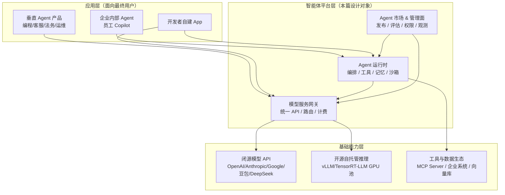

平台有三种典型商业形态，架构差异很大：

| 形态 | 代表 | 收入来源 | 架构重心 |
|------|------|---------|---------|
| 模型路由/推理平台 | OpenRouter、Together、Fireworks、硅基流动 | token 加价（5%–15%）、企业合约 | 网关、路由、GPU 利用率、计量 |
| Agent 开发平台 | Dify、Coze、LangGraph Platform、E2B | 订阅 + 用量（运行/沙箱/席位） | 运行时、可视化编排、工具市场 |
| 企业 Agent 中台 | 大厂内部平台、火山/阿里百炼企业版 | 项目制 + 算力转售 + 席位 | 多租户、权限合规、私有化、成本治理 |

**从零到一建议**：先做"模型网关 + 薄 Agent 运行时"（开发者自助、用量计费），用真实流量养出路由与可靠性能力；再做厚运行时与企业管理面。不要一上来做可视化编排 —— 没有量的编排平台没有护城河。

### 2.2 商业模式与定价结构

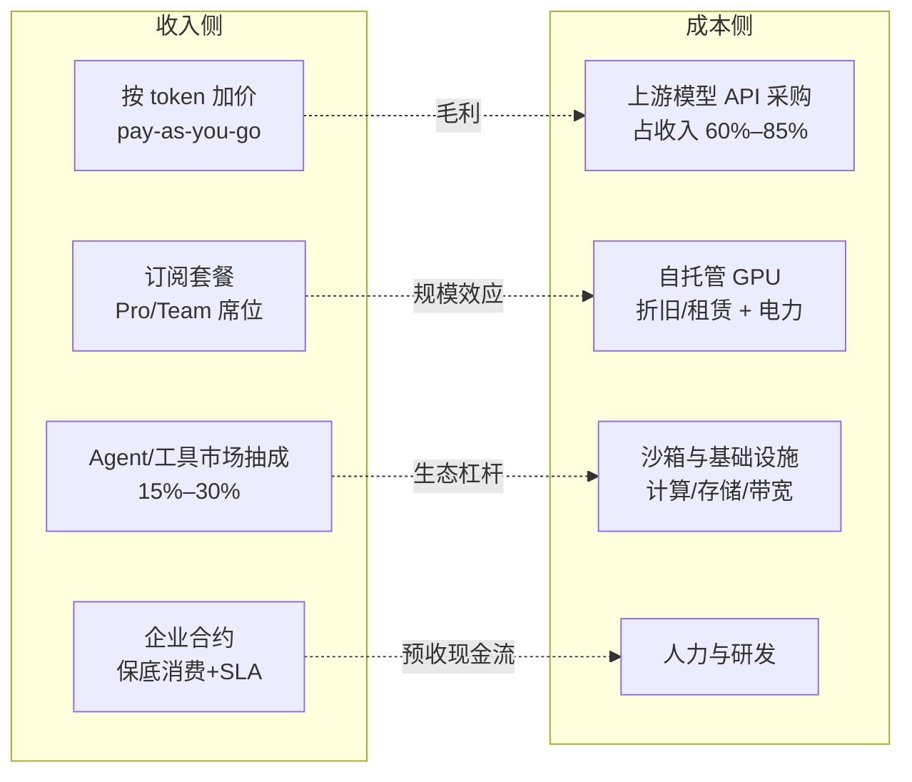

定价与成本要点：

- **加价模式**：标准做法是在供应商到岸成本上加 5%–15%；缓存命中、提示词缓存（Prompt Caching）、语义缓存命中部分可按折扣价计费，既降价又保毛利。
- **Agent 任务的计价单位要从"token"升级为"任务/步骤"**：一次 Agent 任务可能消耗 10 万–100 万 token，纯 token 定价会让用户失控；平台应同时提供"每任务预算上限（max cost budget）"。
- **成本护栏即产品功能**：per-key 预算、per-任务预算、异常消费告警，是企业付费的核心理由。
- 自托管开源模型的盈亏平衡点：GPU 利用率持续 >40%–60% 时，自托管热门开源模型（Qwen/Llama/DeepSeek 小尺寸）单位 token 成本可低于 API 采购价的 1/3–1/2；长尾模型走 API 更划算。

### 2.3 计费与计量架构（收入生命线）

计量计费是平台最不能出错的子系统：**宁可少计费不可重复计费，计量数据必须可审计、可重放**。

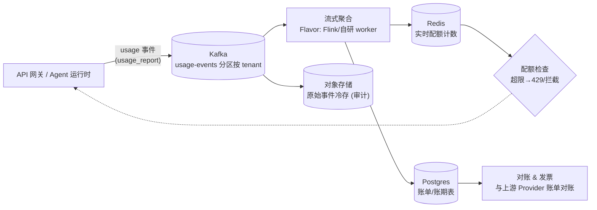

设计要点：

- **事件溯源**：每次模型调用、每次工具调用产出一条不可变 usage event（tenant、key、model、prompt/completion tokens、cost、run_id、trace_id），先写 Kafka/WAL 再返回，计费链路与请求链路解耦。
- **双维度计量**：token 维度（模型成本）+ 资源维度（沙箱秒数、向量库 QPS、存储 GB），Agent 平台两类成本都要收。
- **配额实时化**：Redis 滑动窗口 + 每分钟同步 DB 兜底；限流用 GCRA（见 4.4）。
- **对账闭环**：平台账单与上游 Provider 月度账单自动 diff，差异 >0.5% 报警 —— 路由错配模型版本是常见漏费原因。

---

## 3. 总体系统架构（从零到一）

### 3.1 分层总体架构图

平台按**三个平面**组织：数据面（请求热路径，追求低延迟高可用）、控制面（管理配置，追求一致）、智能体面（长时运行，追求可恢复）。

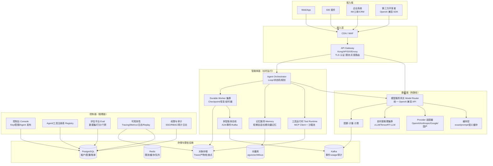

### 3.2 各层职责与关键设计决策

| 层 | 核心职责 | 关键决策 |
|----|---------|---------|
| 接入层 | TLS、WAF、统一域名、L7 限流、灰度 | API Gateway 只做"粗"策略；业务路由放模型网关，避免双份路由逻辑 |
| 模型服务网关 | 统一 API（OpenAI 兼容）、模型路由、故障转移、流式聚合、缓存 | **无状态、水平扩展**；所有 Provider 差异收敛在适配器内 |
| Agent 运行时 | Agent Loop、工具调用、状态检查点、HITL 中断 | **Durable Execution**：运行状态外置到检查点存储，Worker 可随时被杀 |
| 工具运行时 | MCP 客户端、工具沙箱、凭证代理 | 工具执行与模型调用物理隔离；沙箱一次性、最小权限 |
| 记忆服务 | 会话上下文、长期记忆、摘要压缩 | 热记忆 Redis，温记忆 Postgres，冷记忆向量库 + 对象存储 |
| 控制面 | 租户、Key、Agent 发布、评估、观测 | 控制面故障不影响数据面（配置本地缓存 + 异步生效） |
| 存储 | OLTP / 缓存 / 消息 / 对象 / 向量 | Postgres 为系统记录源；Kafka 为事件骨干；不引入运维负担过重的组件 |

### 3.3 技术选型：MVP 与规模期对照

原则：**MVP 用" boring technology "快速验证，把复杂度预算留给路由和可靠性**。

| 组件 | MVP（0–6 月） | 规模期（18 月+） | 替换触发点 |
|------|--------------|-----------------|-----------|
| 网关语言/框架 | Python FastAPI + uvicorn | Go/Rust 重写热路径 + Python 保留策略层 | p99 网关开销 >20ms 或 QPS >2k |
| API Gateway | 云厂商 ALB + 简单限流 | Kong/APISIX/Envoy + 自研插件 | 多租户灰度/自研限流需求 |
| Provider 接入 | httpx + OpenAI SDK 适配 | 适配器插件市场 + 合同测试 | 模型数 >20 |
| 自托管推理 | 单节点 vLLM + Docker | vLLM/SGLang + K8s + KV cache 池化 + 分离式推理 | 自托管 token 占比 >30% |
| Agent 编排 | 自研轻量 Loop（200 行） | LangGraph/Temporal 自研后端 | 出现长时任务/HITL 恢复需求 |
| 沙箱 | Docker 容器 | Firecracker microVM / gVisor / E2B | 多租户不可信代码执行 |
| 队列 | Redis Streams | Kafka | 事件回溯/多消费者 |
| 状态库 | Postgres + Redis | Postgres 分库 + Redis Cluster | 单库 >2TB 或写 >5k QPS |
| 向量库 | pgvector | Milvus/Qdrant 独立集群 | 向量 >1 亿条 |
| 可观测 | Langfuse 开源自托管 | OpenTelemetry + ClickHouse + 自研 | trace 量 >10 亿/月 |
| MCP | 官方 Python/TS SDK | 自研 MCP Gateway + Registry 镜像 | 接入 >10 个 MCP Server |

### 3.4 从零到一演进路线

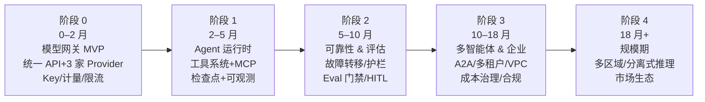

每个阶段的"完成定义"：

- **阶段 0**：`curl` 一个 OpenAI 兼容端点可调通 3 家模型；自动故障转移；按 key 计量出账。
- **阶段 1**：一个 ReAct Agent 能调用 5 个工具完成任务；Worker 杀进程后任务可恢复；每条 run 有完整 trace。
- **阶段 2**：Provider 全挂演练中请求成功率 >99.7%；Prompt/Agent 变更必须过 Eval 门禁；高危工具调用有人工审批。
- **阶段 3**：3 个专业 Agent 通过 A2A 协作完成跨域任务；企业客户在独立 VPC 部署；per-team 成本看板。
- **阶段 4**：多区域 active-active；自托管推理占比 >40% 且单位成本下降一半；第三方 Agent/工具市场成交。

---

## 4. 模型服务平台实现方案

模型服务平台是整个智能体平台的"发电厂"。它对上提供 **OpenAI 兼容的统一 API**，对下屏蔽几十家模型供应商与自托管集群的差异。

### 4.1 组件设计图

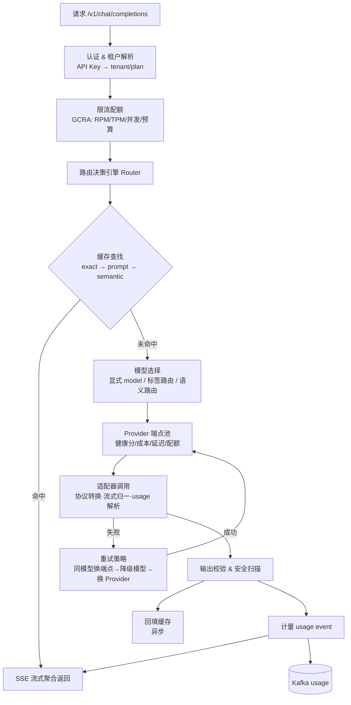

### 4.2 统一 API 与 Provider 适配器

- **对外契约**：100% 兼容 OpenAI `chat/completions`（含 streaming、tools、response_format、json_schema、logprobs），客户零改动迁移。这是路由类平台的入场券。
- **适配器模式**：每家 Provider 一个 Adapter，实现统一接口：`normalize_request()` / `parse_stream_chunk()` / `normalize_usage()` / `error_map()`。各家差异（Anthropic 的 `system` 字段、Google 的 `contents` 结构、国产厂商的流式 usage 缺失、工具调用格式差异）全部收敛在此。
- **模型目录（Model Catalog）**：模型不是硬编码字符串，而是控制面管理的实体：`{provider, model_id, context_window, price_in/out, capabilities, modality, health_score, routing_tags}`。新增模型 = 配置发布，不是发版。
- **能力协商**：客户请求 `tools` 但目标模型不支持 function calling 时，适配器层做降级（prompt 模拟工具调用）或直接路由到支持的模型，而不是报错。

### 4.3 路由与故障转移（核心竞争力）

路由决策综合四个信号：**健康度（错误率/超时）、成本（到岸价）、延迟（近期 p99）、余量（Provider 配额/RPM 上限）**。

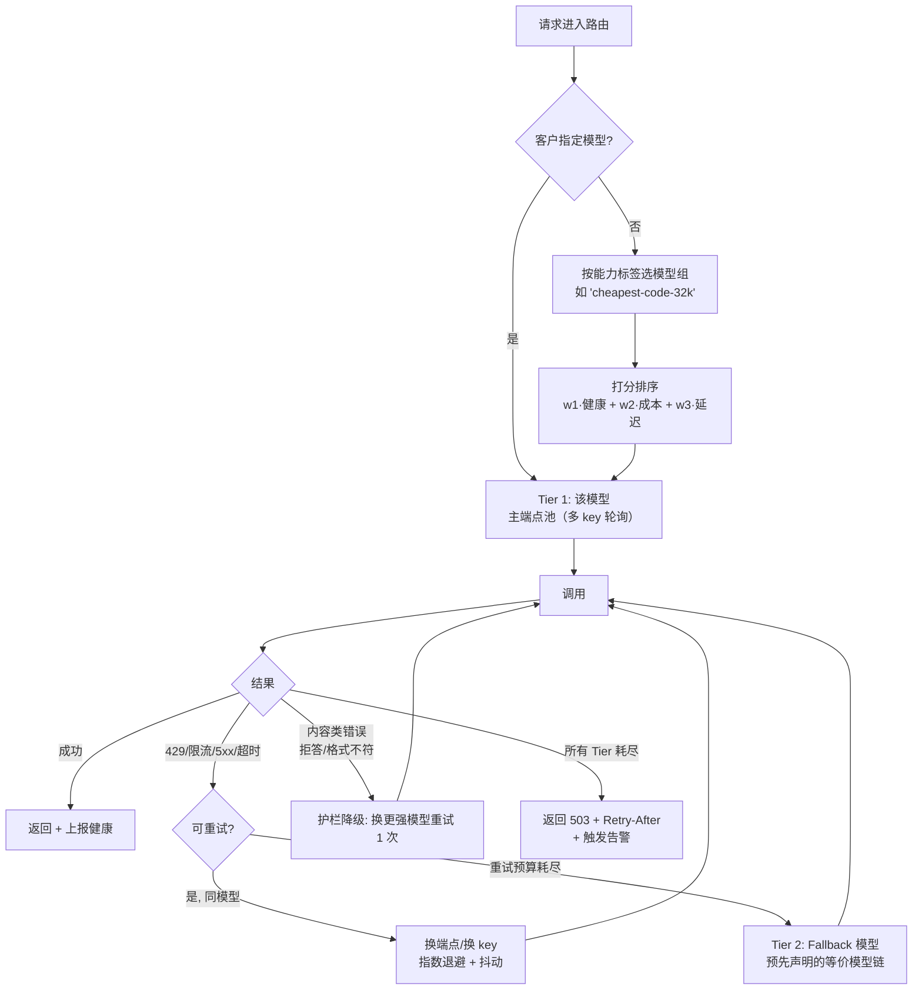

要点：

- **Fallback 链是声明式配置**，不是代码：`gpt-4o → claude-sonnet → qwen-max`，由策略团队按评测维护；跨厂商 fallback 时适配器自动做协议与能力降级。
- **熔断**：端点错误率 >阈值（如 10%/30s）主动熔断 30–120s，半开探测恢复，避免把流量打进正在故障的 Provider。
- **对冲请求（Hedging）**：对超高优请求，p95 延迟未返回即发第二个端点请求，取先返回者（成本换延迟，仅对高 SLA 客户开启）。
- **重试要有预算**：每请求最多 N 次（通常 2–3）、总超时预算（如 60s）、幂等键（`Idempotency-Key`）防重复扣费/重复副作用。

路由核心逻辑的参考实现（Python，简化版）：

```python
# examples/special-06/model_router.py
"""模型路由 + 故障转移的简化实现（生产需补全流式/指标/熔断）"""
import asyncio
import time
from dataclasses import dataclass, field


@dataclass
class Endpoint:
    provider: str
    model: str
    price_per_1m_in: float
    price_per_1m_out: float
    # 健康状态（由探测/调用结果滑动窗口更新）
    err_rate: float = 0.0
    p99_latency: float = 1.0
    quota_left: int = 1_000_000
    circuit_open_until: float = 0.0

    def score(self) -> float:
        """分数越低越优先：健康权重最大，其次成本、延迟"""
        if time.time() < self.circuit_open_until or self.quota_left <= 0:
            return float("inf")
        return 100 * self.err_rate + self.price_per_1m_out + 0.1 * self.p99_latency


RETRYABLE = {429, 500, 502, 503, 504}


class ModelRouter:
    def __init__(self, catalog: dict[str, list[Endpoint]], fallback_chain: dict[str, list[str]]):
        # catalog: 逻辑模型 -> 端点列表；fallback_chain: 模型 -> 降级模型链
        self.catalog = catalog
        self.fallback_chain = fallback_chain

    def _candidates(self, model: str) -> list[Endpoint]:
        chain = [model] + self.fallback_chain.get(model, [])
        eps = [ep for m in chain for ep in self.catalog.get(m, [])]
        return sorted(eps, key=Endpoint.score)

    async def chat(self, model: str, payload: dict, max_attempts: int = 3):
        last_exc = None
        for attempt, ep in enumerate(self._candidates(model)[: max_attempts + 1]):
            try:
                # adapter.call 内部完成协议转换、SSE 归一、超时控制
                result = await call_with_timeout(ep, payload, timeout=60)
                report_success(ep)  # 更新健康窗口
                return result
            except ModelAPIError as e:
                last_exc = e
                report_failure(ep, e.status)
                if e.status not in RETRYABLE:
                    raise  # 4xx（除 429）是请求本身问题，不重试
                await asyncio.sleep(min(2 ** attempt, 8) * (0.5 + 0.5 * jitter()))
        raise ServiceUnavailable("all endpoints exhausted") from last_exc
```

### 4.4 限流、配额与多租户隔离

- **限流维度**：RPM（请求/分）、TPM（token/分）、并发流数、日/月预算。多维度叠加，任一超限即 429 + `Retry-After`。
- **算法选 GCRA（通用信元速率算法）**：比令牌桶更适合多维度、支持突发的平滑限流，Redis Lua 脚本原子执行，单实例可支撑十万级 key 的判定。
- **优先级与公平性**：企业合约客户 > 订阅 > 免费；上游 Provider 配额紧张时按优先级降级而非全局拒绝；免费档在高峰期排队（返回 202 + 轮询或 SSE 等待位）。
- **多租户隔离**：热路径无状态天然隔离；自托管推理按租户/优先级分 GPU 池或用 vLLM 优先级队列，防止单租户跑满 KV cache 影响他人（noisy neighbor）。

### 4.5 三级缓存

| 级别 | 命中条件 | 实现 | 典型命中率/收益 |
|------|---------|------|----------------|
| 精确缓存 | 相同 model + messages + 参数（hash） | Redis，TTL 24h | 客服/FAQ 场景 20%–40% |
| 提示词缓存 | 长 system prompt / 少-shot 前缀复用 | 利用 Anthropic/OpenAI/DeepSeek 官方 Prompt Caching + 自托管 vLLM prefix caching | 长上下文场景省 30%–70% 输入成本、TTFT 降一半 |
| 语义缓存 | 问题语义等价（embedding 相似度 + 阈值） | 向量库 + 答案模板，仅对确定性问答开启 | 客服场景再提 10%–20%，**Agent 工具链路禁用** |

> ⚠️ 语义缓存必须带租户隔离与时效性标签：涉及私有数据、实时数据（库存/价格）、个性化回答的请求一律 bypass。

### 4.6 自托管推理集群

当自托管 token 占比超过 ~30%，建设自托管推理能力：

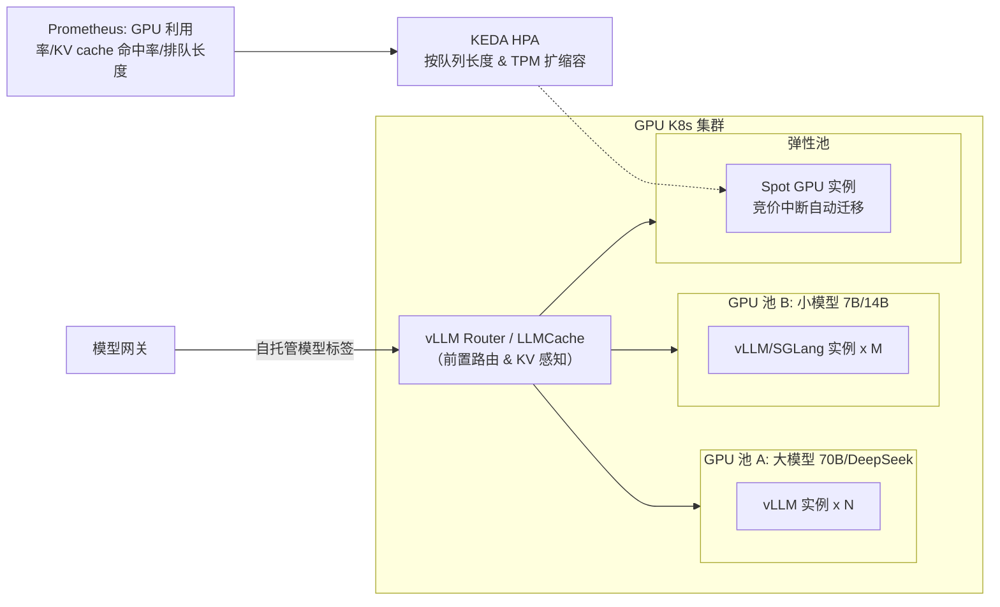

关键工程点：

- **推理引擎**：vLLM / SGLang（PagedAttention、连续批处理、prefix caching）；追求极致延迟用 TensorRT-LLM。
- **扩缩容**：冷启动加载模型耗时 2–10 分钟，不能靠 CPU 式 HPA —— 用**按时间段预扩容 + 队列长度 KEDA + 大小模型池混搭**；Spot 实例只跑可中断的批处理/离线任务。
- **KV cache 治理**：vLLM 的 `gpu_memory_utilization` 与最大并发调参；跨实例 prefix 共享用 LMCache/Router 做 KV 亲和路由；规模期上 **prefill/decode 分离**（Prefill 节点算首 token，Decode 节点管长生成）。
- **网关视角统一**：自托管实例在 Model Catalog 里就是一个特殊 Provider，健康检查/熔断/计量逻辑与云 API 完全复用。

### 4.7 端到端请求时序（热路径）

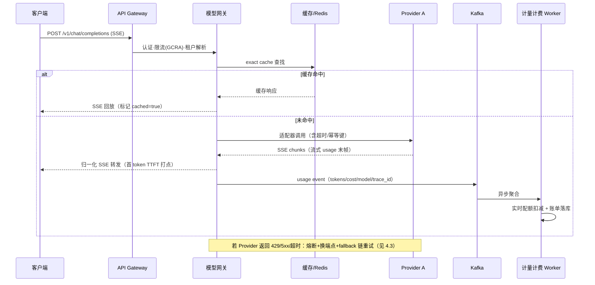

---

## 5. Agent 运行时与智能体工程

模型网关解决"把一次调用做可靠"，Agent 运行时解决"把一个**分钟级、几十步、有副作用**的任务做可靠"。这是智能体工程（Agent Engineering）与普通 LLM 应用开发的分水岭。

### 5.1 Agent Loop 与运行状态机

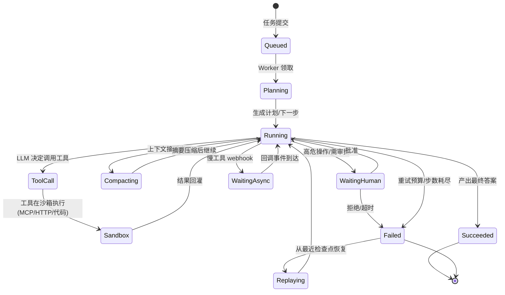

状态机的工程含义：

- **每一步都是持久化的事件**：`Run`（一次任务）由多个 `Step` 组成，每个 Step（LLM 调用、工具调用、人工审批）写一条事件到检查点存储。Worker 在任意步骤崩溃，新 Worker 从最后一个完成的 Step 重放 —— 这就是 Durable Execution（Temporal / LangGraph Checkpointer / Cloudflare Workflows 同一思想）。
- **步数与预算护栏**：max_steps（如 30/50）、max_wall_time、max_cost 三重预算，超限进 Failed 并给出明确原因，防止 Agent 死循环烧钱。
- **可重放 ≠ 重放副作用**：重放时已完成的工具调用（尤其有副作用的：发邮件、下单）必须通过**幂等键 + 结果缓存**跳过，而不是重新执行。

Durable Agent Loop 的参考骨架：

```python
# examples/special-06/durable_agent.py
"""Durable Agent Loop：状态外置、步骤可重放、副作用幂等"""
import json
from dataclasses import dataclass


@dataclass
class RunState:
    run_id: str
    messages: list[dict]
    step: int = 0
    cost: float = 0.0


class AgentRuntime:
    def __init__(self, model_router, tool_runtime, checkpointer, budget):
        self.router = model_router          # 见第 4 节
        self.tools = tool_runtime           # 见 5.3
        self.cp = checkpointer              # Postgres/S3 检查点存储
        self.budget = budget                # max_steps / max_cost / max_seconds

    async def run(self, run_id: str, user_input: str):
        state = await self.cp.load(run_id) or RunState(run_id, [{"role": "user", "content": user_input}])
        while True:
            # 预算检查（防死循环/失控成本）
            if state.step >= self.budget.max_steps or state.cost >= self.budget.max_cost:
                return await self._finish(state, status="failed: budget exceeded")
            state.step += 1

            resp = await self.router.chat("agent-default", {"messages": state.messages, "tools": self.tools.schemas()})
            state.messages.append(resp.message)
            state.cost += resp.cost
            await self.cp.save(run_id, state)           # 每步检查点

            if not resp.message.get("tool_calls"):
                return await self._finish(state, status="succeeded")

            for call in resp.message["tool_calls"]:
                # 幂等键 = run_id + step + call_id：重放时直接取缓存结果
                result = await self.tools.execute(
                    tool=call.name, args=json.loads(call.arguments),
                    idempotency_key=f"{run_id}:{state.step}:{call.id}",
                )
                state.messages.append({"role": "tool", "tool_call_id": call.id, "content": result})
            await self.cp.save(run_id, state)
```

### 5.2 上下文工程（Context Engineering）

Agent 质量的上限往往不取决于模型，而取决于喂给模型的上下文。上下文管理策略：

| 层 | 内容 | 存储 | 策略 |
|----|------|------|------|
| 工作记忆 | 当前对话消息 | 检查点内 | 滑窗 + 工具结果截断 |
| 摘要记忆 | 历史对话压缩摘要 | Postgres | 接近窗口阈值时触发 LLM 摘要（Compacting） |
| 长期记忆 | 用户偏好、事实、经验 | 向量库 + 知识图 | 检索注入；写入需经过"是否值得记"判断 |
| 环境上下文 | 当前时间、用户身份、权限、可用工具 | 运行时注入 | 每轮系统提示刷新 |

关键规则：**工具结果不能原样无限回灌**。大结果（网页、文件、SQL 结果集）先落对象存储，上下文里只放引用句柄 + 摘要，模型需要细节时再按需读取（handle-based context）——这是长任务 Agent 控成本和控幻觉的核心手法。

### 5.3 工具运行时与沙箱

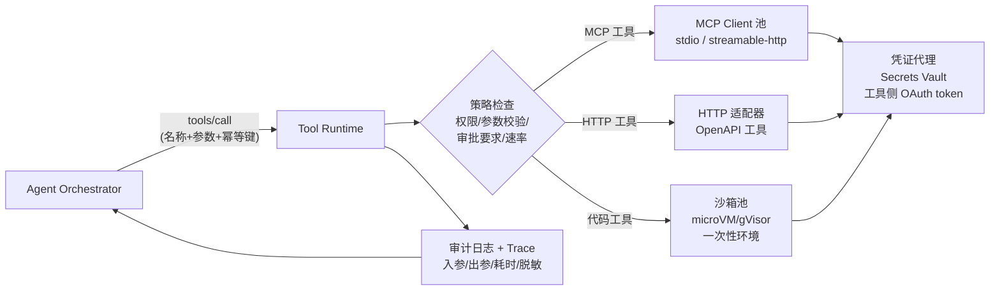

设计要点：

- **三类工具统一接口**：MCP 工具（生态标准，见第 8 节）、HTTP/OpenAPI 工具（企业现有系统）、代码执行工具（Python/Shell 跑在沙箱）。Agent 只看到统一的 tool schema。
- **沙箱是安全边界**：多租户场景执行不可信代码必须用 microVM（Firecracker / Cloudflare Sandbox / E2B / Daytona）或 gVisor；Docker 容器只在单租户内网用。沙箱一次性使用、无网络白名单不开网、文件系统临时、CPU/内存/时长硬限额。
- **凭证不落 Agent**：工具的 OAuth token、API Key 存在 Vault，由 Tool Runtime 代理注入，模型永远看不到真实凭证（防 prompt 注入套取密钥）。
- **工具结果脱敏与审计**：出入参加密落审计日志，PII 字段脱敏后再进模型上下文。

### 5.4 可观测性：Agent Run 的 Trace 模型

一次 Run 必须能完整重放。遵循 OpenTelemetry GenAI 语义约定的 span 树：

```
Run: "帮我查 Q3 销售并生成报告" (trace_id)
├── Span: plan (llm.invoke, model=xxx, tokens=12k, cost=$0.08)
├── Span: tool.call sql_query (db=warehouse, rows=2300, 4.2s)
├── Span: llm.invoke (tokens=8k)
├── Span: tool.call mcp:crm.get_account (1.1s)
├── Span: human.approval (waited 3m12s, approved)
├── Span: tool.call code_exec sandbox (sandbox=fc-7f3a, 6.8s)
└── Span: llm.invoke final (tokens=3k)
```

每个 span 记录：输入输出（可脱敏）、模型、token、成本、延迟、重试次数、错误。Langfuse / Phoenix（Arize）/ 自研 ClickHouse 均可；**Trace 同时服务三个用户**：开发者调试、评估平台打分（见第 9 节）、财务成本归因。

---

## 6. 构建可靠的智能体系统

Agent 系统的失败面远大于传统服务：模型不确定性、外部工具、长链路、副作用。可靠性工程的思路是**承认每一步都会失败，把失败当正常路径设计**。

### 6.1 失败模式全景与对策

| 失败类型 | 典型表现 | 对策 |
|---------|---------|------|
| 模型服务故障 | 429/5xx/超时/流式中断 | 重试+熔断+fallback 链（4.3）；幂等键 |
| 模型"行为"故障 | 乱调工具、参数错误、幻觉、跑题 | 结构化输出+参数 schema 校验；Guardrails；Eval 门禁 |
| 工具故障 | 外部 API 宕机/超时/返回脏数据 | 超时预算；重试/缓存降级/人工兜底；工具健康度 |
| 上下文失控 | 窗口爆掉、成本飙升、旧信息干扰 | 压缩（5.2）；预算护栏；结果外置 |
| 循环卡死 | 重复同一工具调用 | 重复检测（同参调用 ≥2 次强制升级）；步数预算 |
| 副作用事故 | 误发邮件、误删数据 | 高危工具 HITL 审批（第 10 节）；dry-run；权限最小化 |
| 安全攻击 | Prompt 注入、数据外泄、工具滥用 | 指令分层、输入隔离、出网管控、凭证代理（6.3） |
| 部分失败 | 多工具并行中一个失败 | Saga 补偿；可选项降级，关键路径中断 |

### 6.2 可靠性模式工具箱

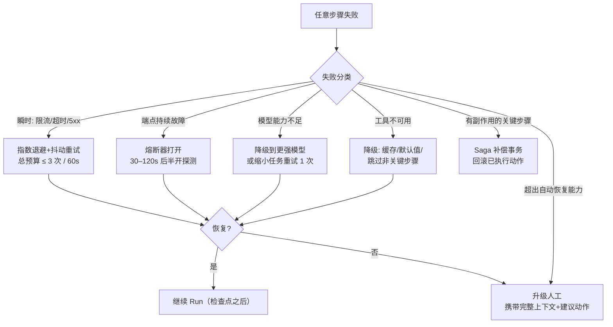

关键原则：

- **超时预算自上而下分配**：整个 Run 预算（如 10 分钟）→ 每个 LLM 调用 60s、每个快工具 10s；下游超时必须小于上游，避免层层堆积。
- **幂等是分布式 Agent 的地基**：所有写操作带幂等键（`run_id:step:call_id`），工具侧按键去重；消息总线用 at-least-once + 消费端去重。
- **背压（Backpressure）**：下游（模型/工具）过载时，入口快速拒绝低优先级任务并排队，而不是把系统拖垮（队列必须有界 + 溢出策略）。
- **慢工具异步化**：超过 30s 的工具（报表生成、部署流水线）走异步：提交 → 返回任务句柄 → webhook/轮询回调 → 事件唤醒 Run（状态机里的 `WaitingAsync`），Worker 线程不被占用。

### 6.3 安全护栏（Guardrails）

Agent 有工具权限 = Agent 是潜在的内部威胁。三道防线：

1. **输入侧**：Prompt 注入检测（工具返回内容/网页内容用"数据"而非"指令"边界包裹，明确标注不可信内容）；越权意图检测。
2. **执行侧**：工具白名单 + RBAC（Agent 继承用户权限而非超级权限）；高危操作（删除、外发、支付、生产变更）强制 HITL；出网域名白名单；命令参数 denylist/allowlist。
3. **输出侧**：PII/敏感信息扫描防外泄；结构化输出 schema 校验失败即重试；DLP 审计。

### 6.4 灰度与配置热更

- Agent 的"代码"是 prompt + 工具集 + 模型版本 + 路由策略，全部版本化（Git 管理，类似 IaC），灰度按租户百分比分流。
- 每个 Run 记录其**配置版本号**，出问题可按版本回滚、按版本对比成功率 —— 这是 Agent 可运维性的前提。

---

## 7. 多智能体与分布式系统

单 Agent 适合个人助理类任务；企业级复杂任务（跨系统、跨域、长流程）需要多智能体协作。核心判断：**先榨干单 Agent，再多 Agent** —— 多 Agent 的协调成本和失败率是乘法关系。

### 7.1 三种编排拓扑

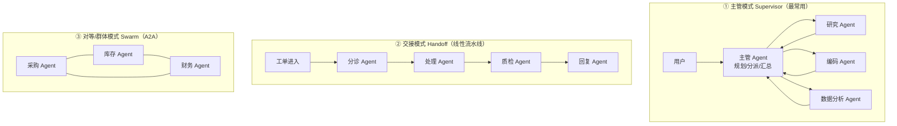

| 模式 | 控制流 | 适用场景 | 风险 |
|------|--------|---------|------|
| Supervisor | 中心化，主管持有上下文 | 任务可分解、子任务边界清晰（研究/编码/审校） | 主管是瓶颈与单点，需控制子 Agent 数量（≤5±2） |
| Handoff | 状态机流水线 | 客服工单、审批流等确定性流程 | 上游错误级联放大，需质检节点 |
| Swarm/A2A | 去中心化，Agent 间直接对话 | 跨组织/跨团队协作（供应商 Agent 对客户 Agent） | 难调试、易死锁；必须设轮次上限与仲裁 |

工程建议：**Supervisor + Handoff 覆盖 90% 企业场景**，且都能在单运行时内实现为子图/子状态机；Swarm/A2A 主要用于跨团队、跨信任域的 Agent 互联（见 8.4）。

### 7.2 分布式运行时架构

把每个 Agent 做成**无状态服务 + 外置状态**，通过消息总线协作：

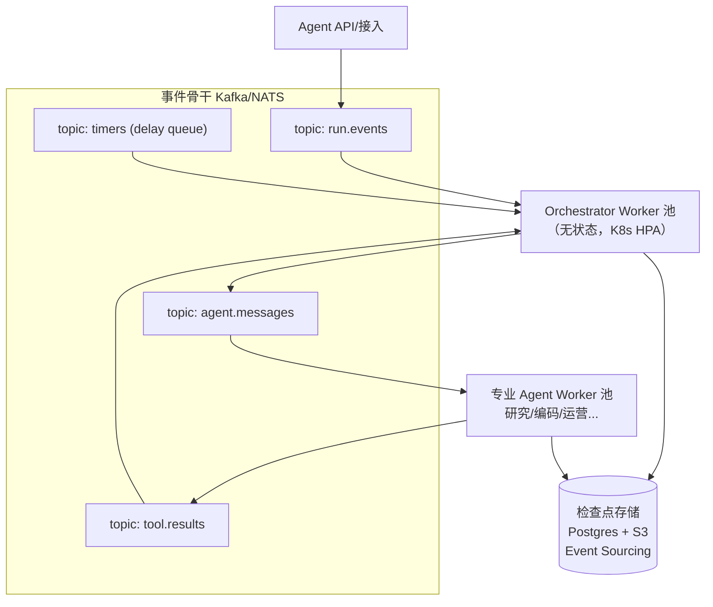

分布式要点：

- **Event Sourcing**：Run 的状态 = 事件日志的折叠。Worker 无状态，靠重放事件恢复；这天然支持暂停/恢复/迁移/审计。
- **至少一次投递 + 幂等消费**：消息总线不保证 exactly-once，消费端用事件 ID 去重（与 5.1 的幂等键体系一致）。
- **Saga 处理跨 Agent 长事务**：每个有副作用的步骤注册补偿动作，整体失败时逆序补偿（如"已建审批单→撤回"）。
- **定时器与唤醒**：`WaitingAsync`/`WaitingHuman` 靠延迟队列（Kafka delay topic / Temporal timer）唤醒，Worker 不空等。
- **死信与卡死治理**：超过 SLA 仍未完成的 Run 进死信队列，自动生成告警 + 人工接管链接。

### 7.3 多智能体的成本与失败率现实

- N 个 Agent 串联，任务成功率 ≈ 各 Agent 成功率连乘（0.9^4 ≈ 0.66）——**Agent 数量要克制**，能用一次结构化调用解决的不要拆 Agent。
- 每个 Agent 边界都有"上下文税"：信息传递靠消息摘要，丢信息是必然；设计时让交接消息结构化（任务书 + 交付物 schema），而非自由文本。
- 主管 Agent 必须能看到**全链路 trace 和成本**，否则无法做有效分派与重试决策。

---

## 8. 互操作性与标准：MCP 最新演进（MCPCon）

2024 年底 Anthropic 发布 MCP（Model Context Protocol）后，2025 年成为"Agent 互操作元年"：MCP 被 OpenAI、Google、微软等全面采纳，社区生态（俗称 MCPCon 生态）爆发式增长。对平台方而言，标准不是选择题而是基础设施 —— **自己发明私有工具协议的时代结束了**。

### 8.1 MCP 核心架构

MCP 是"Agent ↔ 工具/数据"的 USB-C 接口：一个 MCP Server 暴露三类能力 —— Tools（可执行动作）、Resources（可读数据）、Prompts（可复用提示模板）。

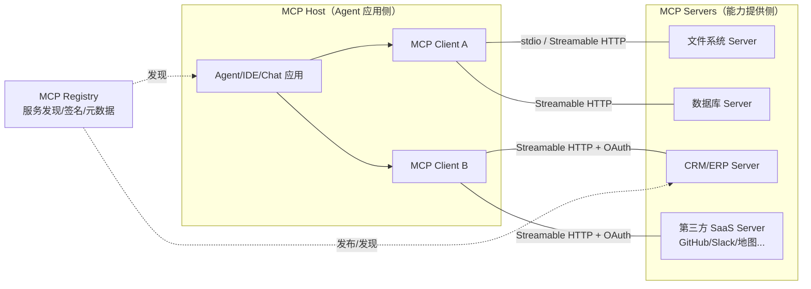

### 8.2 2025 年 MCP 关键演进（对标 MCPCon 最新状态）

| 演进 | 版本/时间 | 解决的问题 | 平台落地意义 |
|------|----------|-----------|-------------|
| **Streamable HTTP** 传输 | 2025-03-26 规范 | 旧 HTTP+SSE 双端点复杂、难过企业网关 | 单端点 `/mcp`，可无状态（水平扩展）或升级为 SSE 长连接；stdio 仅保留本地场景 |
| **OAuth 2.1 授权框架** | 2025-03-26 | 远程 Server 如何安全授权 | 采用 Resource Server Metadata（RFC 9728）+ PKCE；客户端动态发现授权服务器；支持 SaaS 级 MCP 登录 |
| **Elicitation（ elicitation/请求输入 ）** | 2025-06-18 | Server 执行中需要向用户追问补充信息 | 工具不再只能"一问一答"，可中途交互式收集参数（如表单补全） |
| **结构化工具输出** | 2025-06-18 | 工具返回纯文本难解析 | Tool output 携带 JSON Schema 结构化内容，Agent 消费更可靠 |
| **Resource Links / 工具注解** | 2025-06-18 | 工具返回引用其他资源；只读/破坏性标注 | 支持 5.2 的句柄式上下文；`readOnlyHint`/`destructiveHint` 直接驱动 HITL 策略 |
| **MCP Registry** | 2025 年中上线 | 成千上万个 Server 如何发现与信任 | 官方注册中心 + 自托管企业 Registry；支持签名/验证/版本元数据 |
| **治理标准化** | 2025 | 单一厂商控制风险 | 技术指导委员会（TSC）多厂商治理；同期 Google 将 A2A 捐赠 Linux Foundation |
| 进行中的方向 | 社区提案 | 长任务 Tasks、跨 Server 工具编排、WebRTC/新传输 | 关注 spec 仓库的 PR，平台设计预留扩展点 |

### 8.3 企业级 MCP Gateway

企业不会让每个开发者直连几十个外部 MCP Server（安全、审计、合规都不可控）。平台应提供 **MCP Gateway**：对内是统一的 MCP 入口，对外聚合/代理所有 Server。

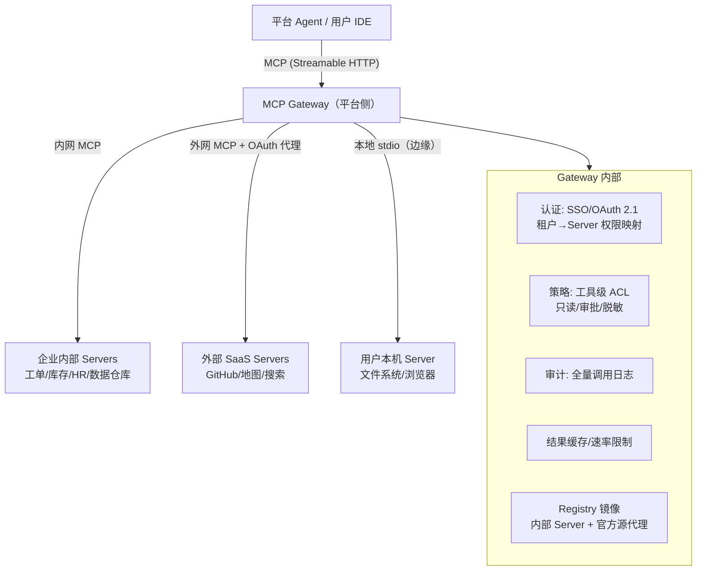

Gateway 的核心价值：

- **统一认证与权限**：员工 SSO 登录后，Gateway 持有各 Server 的 OAuth token（凭证代理，见 5.3），并做"用户身份 → 工具权限"映射；离职 SCIM 停用即全链路回收。
- **审计与 DLP**：所有工具调用经 Gateway 留痕，敏感参数脱敏，出网域名白名单。
- **内部工具市场化**：企业自研 MCP Server 发布到内部 Registry，Agent 开发者一键安装；解决"工具散落各部门"的互操作问题。

MCP Server 最小示例（Python SDK，暴露一个查询工具）：

```python
# examples/special-06/mcp_server.py
"""MCP Server 最小示例：暴露订单查询工具（Streamable HTTP 部署）"""
from mcp.server.fastmcp import FastMCP

mcp = FastMCP("order-service")


@mcp.tool()
def get_order(order_id: str) -> dict:
    """根据订单号查询订单状态。仅允许查询本人有权限的订单。

    Args:
        order_id: 订单编号，形如 ORD-2025xxxx
    """
    order = db.query("SELECT * FROM orders WHERE id = %s", order_id)  # 权限过滤在 SQL 层
    if not order:
        return {"ok": False, "error": "order not found"}
    return {"ok": True, "status": order.status, "amount": order.amount,
            "resource_link": f"mcp://order-service/resources/invoice/{order_id}"}


if __name__ == "__main__":
    mcp.run(transport="streamable-http", host="0.0.0.0", port=8300)
```

### 8.4 标准版图：MCP、A2A、AGENTS.md 各管什么

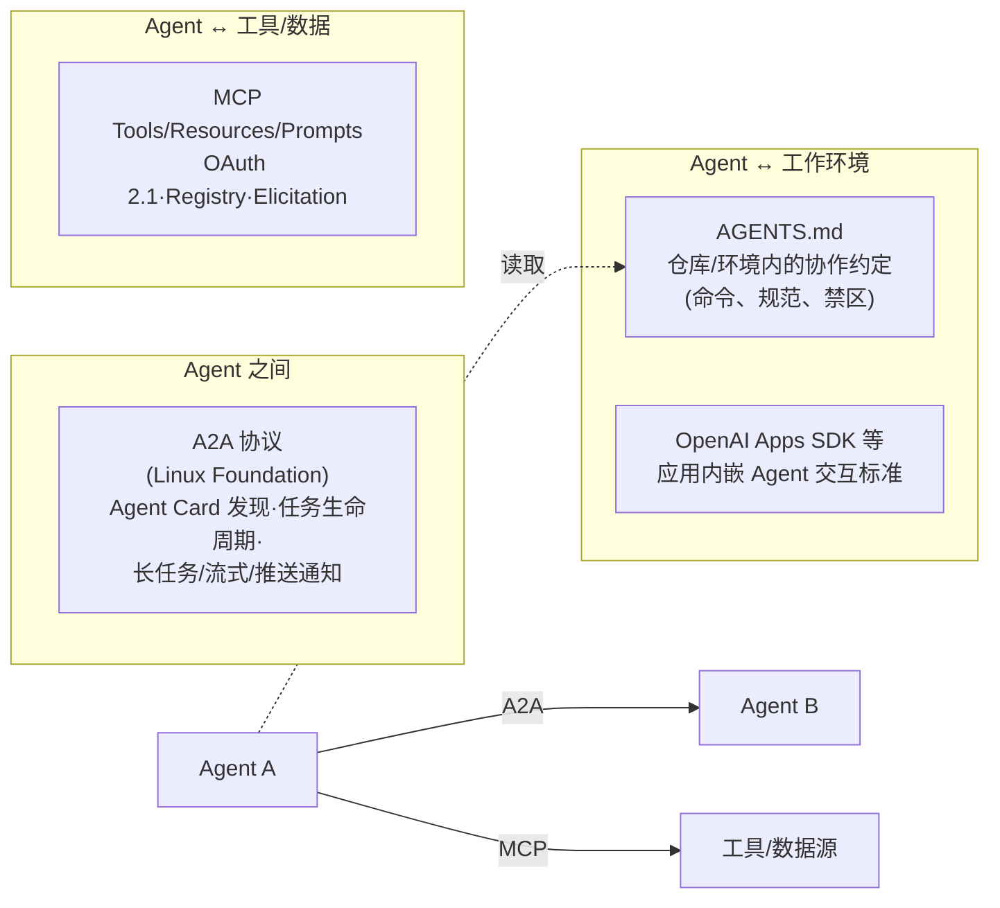

- **MCP**：解决"Agent 怎么用工具"（垂直能力接入）。
- **A2A（Agent2Agent）**：解决"Agent 怎么找 Agent、怎么给另一个 Agent 派任务" —— 核心概念是 **Agent Card**（`/.well-known/agent.json` 声明能力、认证方式、端点）与 Task 对象（提交、状态查询、流式产出、制品交付）。适用于 7.1 的 Swarm 跨组织场景。
- **AGENTS.md**：解决"Agent 进入一个代码库/环境后遵守什么规则"，是轻量事实标准。
- 平台策略：**工具接入全部 MCP 化；跨团队/跨企业 Agent 协作走 A2A；Agent 运行环境约定用 AGENTS.md**。私有协议只允许出现在遗留系统适配层。

---

## 9. 智能体评估与测试

传统软件测试断言"函数输出 == 期望值"；Agent 测试要回答的是"**在开放环境里，Agent 有多大概率完成目标，且不闯祸**"。评估体系是智能体平台从"demo 能跑"到"敢上线"的唯一桥梁。

### 9.1 指标体系（三层）

| 层 | 指标 | 度量方式 |
|----|------|---------|
| 任务结果层 | **任务成功率**（Task Success Rate） | 端到端目标是否达成（人工/规则/LLM 裁判） |
| | 人工升级率、放弃率 | HITL 与用户行为统计 |
| 轨迹过程层 | **工具调用准确率**（选对工具+参数对） | 参照 tau-bench 方法：对比期望工具序列 |
| | 轨迹效率（步数、token、成本、时延） | Trace 统计 |
| | 违规率（越权/注入成功/危险操作） | 红队测试 |
| 系统层 | TTFT、端到端时延、失败率预算达成 | 1.3 节 SLO 看板 |

### 9.2 离线评估：从"答题"到"评轨迹"

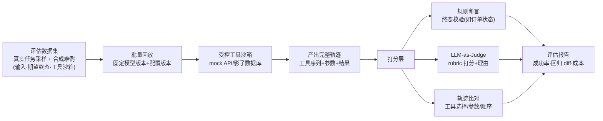

实践要点（对标 τ-bench / τ²-bench、AgentBench、SWE-bench 方法论）：

- **评终态，不只评文本**：在沙箱/影子系统里执行，检查真实世界状态（订单是否正确创建、退款金额是否对），这是 τ-bench 的核心思想，客服/运维类任务必备。
- **数据集构成**：70% 生产日志脱敏回放 + 20% 已知失败案例回归 + 10% 红队对抗样本（注入、越权、诱导）。
- **LLM 裁判要校准**：裁判模型用强模型、给明确 rubric、定期与人工标注对齐（一致率 >85% 才可信）；分数 + 理由双记录，支持抽样人工复核。
- **成本/延迟同样进报告**：成功率涨 2% 但成本涨 3 倍的版本不应自动通过。

### 9.3 在线测试与实验

| 手段 | 做法 | 用途 |
|------|------|------|
| Shadow（影子流量） | 新版本 Agent 复制生产流量执行但不产生副作用（工具走 dry-run/mock） | 上线前对比成功率与成本，零风险 |
| Canary（金丝雀） | 1%–5% 真实流量切新版本，按 SLO 自动回滚 | 小流量验证 |
| A/B | 按租户随机分组，比较任务成功率/升级率/成本 | 策略类变更（prompt、模型） |
| 混沌工程 | 故障注入：Provider 5xx、工具超时 30s、MCP Server 断连、沙箱 OOM | 验证 6.2 的容错路径真的生效（定期 GameDay） |
| 红蓝对抗 | 红队持续尝试 prompt 注入、越权工具调用、数据套取 | 安全护栏有效性 |

### 9.4 发布门禁：把评估接入 CI/CD

Agent 的变更是 prompt / 工具 schema / 模型版本 / 路由策略，它们要像代码一样过门禁：

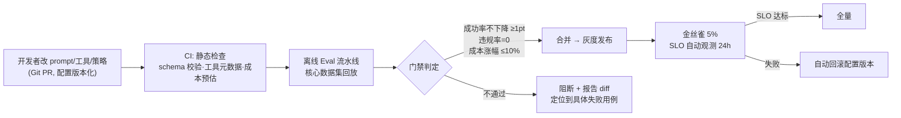

- 门禁阈值按业务风险调整：**安全违规类指标零容忍**（一个注入成功即阻断），成功率允许小幅波动。
- 每次 Run 携带 `config_version`，线上问题可按版本聚合，30 秒级回滚。

### 9.5 测试金字塔（Agent 版）

```
        /\
       /红队\          持续对抗（注入/越权/数据泄露）
      /------\
     / 端到端 \        影子回放 + 沙箱终态断言（慢、贵，少量核心链路）
    /----------\
   /  轨迹评估   \      工具序列/参数断言（tau-bench 式，离线批量）
  /--------------\
 / 单元·契约测试  \    工具 schema、适配器协议、fallback 配置、MCP 合同
/------------------\
```

- **契约测试特别重要**：300+ 模型与几十个 MCP Server 都是外部依赖，适配器要有"金丝雀用例集"（每种模型/每个工具每天定时跑标准用例），上游悄悄改行为能在客户之前发现。

---

## 10. 人机协作（Human-in-the-Loop）

可靠的 Agent 系统不是"全自动"，而是"**自动做小事，大事问人，出事人能接管**"。HITL 是企业敢把生产权限交给 Agent 的前提。

### 10.1 三种协作模式

| 模式 | 触发 | 延迟特征 | 场景 |
|------|------|---------|------|
| 审批式（Approval） | 破坏性/高危动作前（发外部邮件、删数据、支付、生产变更） | 分钟级等待 | 财务、运维、CRM 写操作 |
| 协助式（Assistance） | Agent 主动求助：缺信息、多方案决策、置信度低 | 即时插入 | 表单补全（对应 MCP Elicitation）、路径选择 |
| 接管式（Takeover） | 用户/客服主动切入，或 Agent 升级 | 人工全接管，Agent 退为副驾 | 客服升级、异常处置 |

审批策略由工具注解驱动（MCP `destructiveHint` / 自定义风险等级）：低风险自动执行；中风险记录事后审计；高风险同步等待审批。

### 10.2 中断/恢复时序（Durable HITL）

关键设计：**人可以花 3 小时审批，但系统资源不能等 3 小时**。Run 在等待点持久化挂起，Worker 释放；审批回调到达后按事件唤醒。

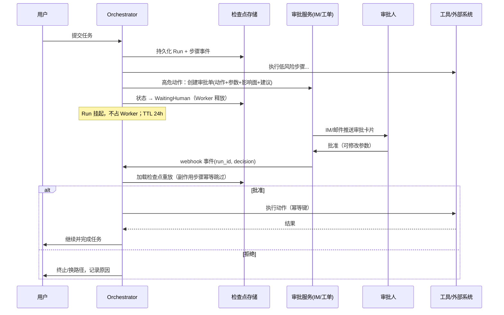

要点：

- **审批卡片要给足上下文**：动作、参数、影响范围、Agent 的理由与置信度、替代方案 —— 审批人 30 秒能判断；附带"改参数再执行"入口，让审批变成轻量协作而非路障。
- **升级链**：审批超时（如 2h）自动升级到上级或转人工队列；拒绝原因结构化回流到评估数据集。
- **权限一致**：审批人权限必须覆盖该动作（不能让无权限的人批了越权操作）；Agent 的操作身份可配置为"以用户身份"或"服务账号 + 审批背书"。

---

## 11. 企业落地实践

### 11.1 部署形态与多租户

```mermaid
flowchart TB
    subgraph SaaS["SaaS 多租户（标准）"]
        T1["租户 A"] --> SHARED["共享控制面 + 共享网关"]
        T2["租户 B"] --> SHARED
        SHARED --> ISO["逻辑隔离: 行级 tenant_id +<br/>独立 key/配额/向量命名空间"]
    end
    subgraph VPC["VPC 专属部署（中大型客户）"]
        T3["客户 VPC"] --> DED["专属 Agent 运行时 + 沙箱"]
        DED -->|"模型流量"| GW["平台模型网关(私链)"]
        DED --> DB["客户自持数据库/工具"]
    end
    subgraph ONPREM["私有化（强合规）"]
        T4["客户机房"] --> FULL["全栈离线部署<br/>自托管开源模型为主"]
    end
```

- 隔离分级：SaaS 用逻辑隔离（Postgres RLS 行级安全 + Redis key 前缀 + 向量库 collection 隔离）；付费/VPC 客户用运行时专属池 + 加密 KMS 客户托管密钥；强合规全私有化。
- **身份体系**：SSO（OIDC/SAML）+ SCIM 自动入职离职；RBAC 角色（管理员/开发者/审批人/审计员）；服务账号与个人账号分离。
- 网络：私网/专线回源模型网关；工具出网走代理白名单；私有化场景用开源模型 + 本地 MCP Server 全闭环。

### 11.2 合规与安全清单

| 领域 | 要求 |
|------|------|
| 数据 | 传输/静态加密；客户数据不进训练；日志脱敏与留存期策略；数据出境合规 |
| 审计 | 工具调用全量审计日志（谁、什么 Agent、对什么数据、做了什么），不可篡改（WORM） |
| 权限 | 最小权限；Agent 继承用户权限；高危操作 HITL；季度权限复核 |
| 认证 | OAuth 2.1/PKCE；密钥轮转；凭证只在 Vault，不进 prompt/日志 |
| 合规认证 | SOC 2 Type II、ISO 27001、等保（国内）；行业版 HIPAA/金融规范 |
| 模型风险 | 内容安全过滤；红队常态化；高风险行业保留人工终审 |

### 11.3 成本治理（FinOps for Agents）

Agent 让成本从"每次对话几分钱"变成"每个任务几块钱"，成本治理是企业落地的硬需求：

- **三层预算**：组织预算（月度）→ 团队/项目预算 → 单任务预算（`max_cost`），超限告警/拦截。
- **成本归因看板**：按团队/Agent/工具/模型维度分摊（数据来自 trace + usage 事件）；每周 Top 10 昂贵任务复盘。
- **自动省钱策略默认开启**：prompt caching、小模型路由（分类/抽取用小模型）、语义缓存（FAQ 类）、上下文压缩、批处理 API（离线任务）。
- **Showback/Chargeback**：把成本账单打给业务团队，用量自然收敛 30%+。

### 11.4 组织与推广

- 平台团队提供" paved road "：自助接入文档、参考 Agent 模板、成本/评估默认看板 —— 业务团队 1 天能上线第一个 Agent。
- **内部 Agent/工具市场**：各部门把能力封装为 MCP Server 上架，复用替代重复建设（一个"查库存"工具被几十个 Agent 复用）。
- 推广节奏：选 1–2 个高频、容错空间大的场景（内部知识问答、工单分诊、代码审查）打样 → 用成功率/节省工时数据说话 → 再扩核心流程。

---

## 12. 关键架构决策记录（ADR 摘要）

| # | 决策 | 选择 | 否决方案 | 理由 |
|---|------|------|---------|------|
| ADR-01 | 对外 API 契约 | OpenAI 兼容 REST/SSE | 自定义 GraphQL/gRPC | 开发者迁移成本为零，生态工具直接可用 |
| ADR-02 | Agent 执行模型 | Durable Execution（状态外置+重放） | 长驻进程内存态 | Worker 可抢占、任务可暂停数小时等审批 |
| ADR-03 | 工具协议 | MCP 为一等公民，HTTP/代码适配 | 私有插件协议 | 生态、标准、招聘市场全部站在 MCP |
| ADR-04 | 多 Agent 通信 | 同运行时子图为主，跨域用 A2A | 全分布式自由对话 | 成功率连乘、调试成本；Swarm 仅跨信任域 |
| ADR-05 | 语言策略 | 热路径 Go/Rust，策略/编排 Python | 全 Python 或全 Go | 延迟与迭代速度各取所需 |
| ADR-06 | 模型策略 | 多云多 Provider + 热门开源自托管 | 单一供应商 / 全自托管 | 议价权与可靠性靠多云；长尾自托管不经济 |
| ADR-07 | 计量链路 | 事件溯源 + Kafka 异步聚合 | 请求内同步记账 | 计费不影响热路径，可重放审计 |
| ADR-08 | 发布机制 | prompt/策略配置版本化 + Eval 门禁 | 线上直接改 prompt | Agent 变更可回滚、可归因、可比较 |

---

## 13. 演进路线图与实践项目

### 13.1 里程碑与容量对照

| 里程碑 | 时间 | 能力标志 | 容量参考（见 1.2） |
|--------|------|---------|-------------------|
| M0 网关 MVP | 0–2 月 | 统一 API、3 Provider、fallback、计量 | 峰值 20–100 QPS |
| M1 Agent 运行时 | 2–5 月 | Durable loop、5 工具、MCP 接入、Trace | 日工具调用 10 万+ |
| M2 可靠性与评估 | 5–10 月 | 故障演练达标、Eval 门禁、HITL | 日工具调用百万级 |
| M3 多智能体与企业 | 10–18 月 | A2A、VPC 部署、成本治理 | 日工具调用千万级 |
| M4 规模期 | 18 月+ | 多区域、分离式推理、市场生态 | 对标 OpenRouter：峰值 5k–2w QPS、日工具调用亿级 |

### 13.2 实践项目（从零搭建）

1. **迷你模型网关**（1–2 周）：FastAPI 实现 OpenAI 兼容端点，接入 2 家 Provider，实现健康分路由 + fallback + Redis 限流 + token 计量；压测到 100 QPS。
2. **Durable Agent**（2–3 周）：在网关之上实现检查点化 Agent Loop；杀掉 Worker 进程验证任务恢复；接入一个 MCP Server（如文件系统或 GitHub）。
3. **故障演练场**（1 周）：用 toxiproxy/代理注入 Provider 5xx、超时、工具断连，验证熔断/降级/HITL 升级路径，测量端到端失败率是否 <0.3%。
4. **Eval 门禁**（1–2 周）：构建 50 条任务的沙箱评测集，实现终态断言 + LLM 裁判；接入 GitHub Actions，prompt 变更触发回归。
5. **MCP Gateway**（2–3 周）：实现带 OAuth 2.1、工具级 ACL、审计日志的 MCP 代理；对内发布一个自研业务 MCP Server。

---

## 14. 常见误区与最佳实践

**误区**

- 把"Agent demo 跑通"当"平台建成"：demo 没有失败路径、计量、权限、恢复 —— 后 80% 的工作量在可靠性。
- 迷信多 Agent：三个 90% 成功率的 Agent 串联只有 73%；先用好单 Agent + 好工具。
- 工具结果全量回灌：上下文爆炸、成本失控、幻觉增加 —— 用句柄 + 摘要。
- 私有工具协议自成体系：2025 年之后等于主动放弃生态，MCP 是默认答案。
- 用对话满意度当 Agent 指标：必须度量任务终态成功率与工具调用准确率。
- 让 Agent 持超级权限"方便调试"：上线即事故；权限最小化 + 高危 HITL 不可妥协。
- 计费和请求链路耦合：记账抖动拖垮热路径，且无法对账审计。
- 自托管一切：GPU 利用率上不去时，自托管比 API 贵得多；只自托管高频稳定模型。

**最佳实践**

- 每个失败都分层归因（请求/工具/任务），错误预算按层分配。
- 一切状态外置、一切操作幂等、一切变更版本化。
- Trace 是第一等公民：服务调试、评估、财务三个主人。
- Fallback 链、护栏规则、审批策略全部声明式配置，策略与代码解耦。
- 安全上假设"工具返回的内容都是攻击者写的"，凭证永不出 Vault。
- 容量规划用公式（1.2）套自己的业务参数，别抄绝对值。

---

## 15. 延伸阅读

- MCP 官方规范与演进：modelcontextprotocol.io 规范站（2025-03-26 / 2025-06-26 版本说明）、MCP Registry 文档
- A2A 协议：Google A2A 规范与 Linux Foundation 托管公告；Agent Card (`/.well-known/agent.json`)
- Agent 评估：τ-bench / τ²-bench（Sierra，工具调用轨迹评测）、SWE-bench、AgentBench、LangSmith/Langfuse 评测文档
- Durable Execution：Temporal 文档（Workflow 重放模型）、LangGraph Checkpointer / Durable Objects 概念
- 推理优化：vLLM（PagedAttention）、SGLang、LLMCache、prefill/decode 分离架构论文（DistServe/SplitWise）
- OpenRouter 工程博客：路由、provider 抽象、定价与可靠性公开分享
- OpenTelemetry GenAI 语义约定（LLM/Agent span 标准）
- 本教程关联章节：[4.4 Agent 应用开发](../chapter-4/4-4-agent.md)、[4.6 后端 AI 服务](../chapter-4/4-6-backend-ai.md)、[3.3 推理优化技术](../chapter-3/3-3-inference.md)、[7.2 模型服务容量与成本优化](../chapter-7/7-2-cost-optimization.md)

---

[← 返回番外篇目录](README.md) | [返回教程主目录](../../README.md)
