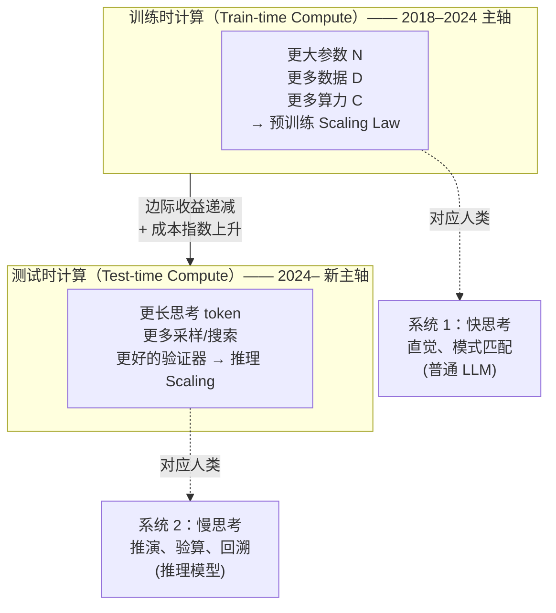
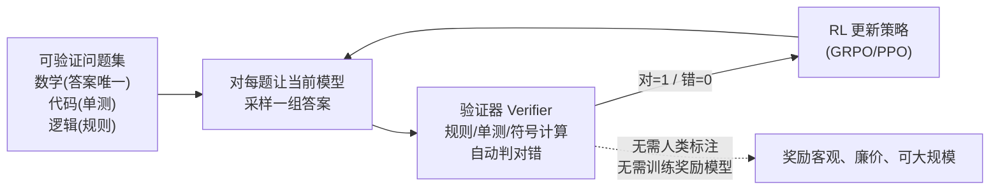
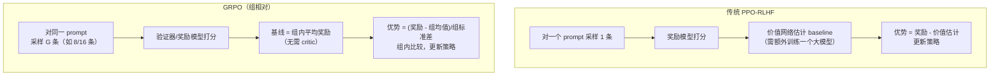
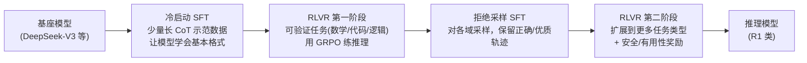
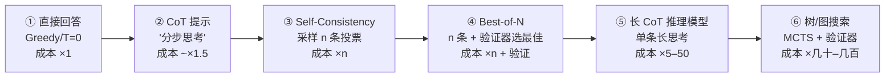
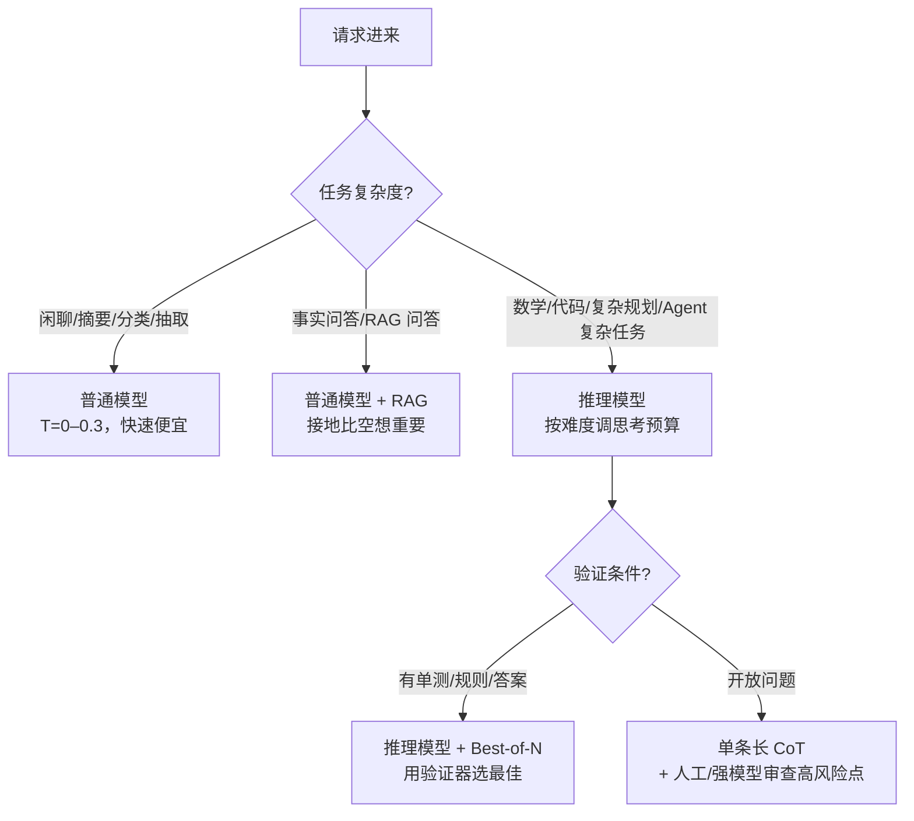

# 番外篇 Special-07：推理模型与测试时计算（Reasoning Models & Test-Time Compute）

> 🧠 **从"快思考"到"慢思考"** —— 2024 年 9 月 OpenAI 发布 o1 起，大模型竞争的主轴从"模型有多大"转向"思考有多久"。本篇系统梳理推理模型的原理、训练配方（RLVR/GRPO/R1）、测试时计算的各种形态、应用与评估。

---

## 学习目标

学完本篇后，你将能够：

- [ ] 说清范式转移：从预训练规模定律到测试时计算（test-time compute）的新 scaling 维度
- [ ] 解释长思维链（Long CoT）为什么能提升复杂推理，及其代价
- [ ] 讲清 RLVR（可验证奖励强化学习）和 GRPO 算法的原理与相对 PPO 的简化
- [ ] 描述 DeepSeek-R1 的训练配方（R1-Zero、冷启动、蒸馏）与启示
- [ ] 列举测试时计算的形态：CoT、Self-Consistency、Best-of-N、树搜索、长 CoT
- [ ] 在应用中合理使用推理模型：思考预算、非思考模式、混合路由、蒸馏小模型
- [ ] 评估推理模型（AIME 等）并理解其局限与安全新挑战

> 阅读前建议掌握：[2.2 预训练与微调](../chapter-2/2-2-pretraining.md)、[术语表「对齐/RLHF 家族」](../GLOSSARY.md)。

---

## 📋 目录

1. [范式转移：为什么是"测试时计算"](#1-范式转移为什么是测试时计算)
2. [长思维链：推理模型的发动机](#2-长思维链推理模型的发动机)
3. [训练推理模型：RLVR 与 GRPO](#3-训练推理模型rlvr-与-grpo)
4. [DeepSeek-R1 案例与启示](#4-deepseek-r1-案例与启示)
5. [测试时计算的光谱](#5-测试时计算的光谱)
6. [推理模型应用指南](#6-推理模型应用指南)
7. [评估与局限](#7-评估与局限)
8. [常见误区与实践建议](#8-常见误区与实践建议)
9. [延伸阅读](#9-延伸阅读)

---

## 1. 范式转移：为什么是"测试时计算"

### 1.1 两个 Scaling 轴



关键事实：

- **预训练 scaling 仍有效但边际变缓**：把模型从 100B 做到 1T 参数，成本指数上升，通用基准提升却越来越有限。
- **推理任务上存在"未被释放的能力"**：同一个模型，允许它"多想一会儿"（写草稿、验算、回溯），数学/代码/科学推理正确率大幅提升 —— 这种能力模型本就具备，只是直接回答时不用。
- **o1 的信号**：2024-09 OpenAI o1 在竞赛数学（AIME）、代码竞赛（Codeforces）、科学问题（GPQA）上相对 GPT-4o 大幅跳变，靠的不是更大模型，而是**用强化学习训练模型产生长思维链 + 推理时投入更多 token**。

### 1.2 什么任务需要慢思考

| 任务特征 | 普通模型（快思考） | 推理模型（慢思考） |
|----------|------------------|------------------|
| 事实问答、闲聊、摘要 | ✅ 足够，且快/便宜 | 浪费（又慢又贵） |
| 分类、抽取、格式转换 | ✅ 低温采样即可 | 不必要 |
| 数学/物理/逻辑证明 | 吃力 | **显著提升** |
| 复杂代码设计与调试 | 一般 | **显著提升** |
| 多步规划、Agent 任务分解 | 容易跑偏 | **明显提升** |
| 需要回溯/验算的高风险决策 | 易犯错 | **明显提升** |

> 记忆口诀：**"检索/直觉"交给普通模型，"推演/验算"交给推理模型**。生产中用路由器按任务难度分配，而不是所有请求都上推理模型。

---

## 2. 长思维链：推理模型的发动机

### 2.1 什么是 Long CoT

普通 CoT（2022）：提示里加一句"let's think step by step"，模型写几行推理再给答案。
**长 CoT（2024–）**：模型被训练成自发产出数百到数万 token 的思考，内含：

- **分解**：把大问题拆成小问题；
- **探索**：尝试多种解法路径；
- **验算**：代入检验、量纲检查、极端情况；
- **回溯**：发现走不通就明确说"此路不通，换一种"；
- **回忆**：引用相关定理、类似题目。

```
普通回答：  问题 → 答案（3 步，~100 token）
长 CoT：    问题 → 【思考：…让我先…等等，这里错了…换方法…验算…】 → 答案（~5,000–50,000 token）
```

### 2.2 为什么 Long CoT 有效

1. **更多计算 = 更多串行推理步**：每个 token 都是一次前向计算，长思考相当于让模型做"串行深度"更深的计算，突破单步 token 的表达极限。
2. **把试错过程外显化**：错了可以在思考中发现并纠正（"等等，我符号搞错了"），相当于把搜索过程写进了序列。
3. **RL 训练塑造了思考的"行为模式"**：模型学到的不是知识，而是**如何分配思考算力**——该在难题上磨、在易题上快速带过。

### 2.3 推理模型的 API 形态（以 OpenAI o 系列/DeepSeek-R1/Qwen-QwQ 为例）

```python
# examples/special-07/reasoning_api.py
"""推理模型的思考预算与输出结构"""
from openai import OpenAI

client = OpenAI()

# 1) 推理模型通常把"思考过程"与"最终答案"分离
resp = client.chat.completions.create(
    model="deepseek-reasoner",          # 或 o-series / qwen-qwq 类
    messages=[{"role": "user",
               "content": "证明：任意 6 个人中必有 3 人互相认识或 3 人互相不认识。"}],
)
# reasoning_content：思考过程（部分 API 单独字段返回）
print("思考长度(tokens):", resp.usage.completion_tokens_details.reasoning_tokens)
print("最终答案:", resp.choices[0].message.content)

# 2) 思考预算控制：max_tokens / reasoning_effort 类参数
#    低预算 = 快、便宜、适合作业级；高预算 = 慢、贵、竞赛级
resp2 = client.chat.completions.create(
    model="o3",
    messages=[{"role": "user", "content": "..."}],
    extra_body={"reasoning_effort": "high"},   # low / medium / high
)
```

要点：

- **思考 token 也计费**（通常比输出 token 便宜或同价），且数量远大于最终答案 —— 推理模型成本是普通模型的 5–50 倍。
- **思考过程默认与最终答案分离**：`reasoning_content`/`reasoning_tokens` 字段；产品上可展示"正在思考…"但通常折叠详细推理链。
- **思考内容不应被当作可信指令**：思考是模型的草稿，可能含错误尝试，注入防护上把它视为模型内部状态而非用户数据或指令。

---

## 3. 训练推理模型：RLVR 与 GRPO

普通 RLHF 的奖励来自**人类偏好或奖励模型**（主观、昂贵、噪声大）；推理任务有个天赐特性：**对错可机械判定** —— 数学答案对不对、代码能不能通过单测、格式是否正确。这就是 RLVR 的根基。

### 3.1 RLVR（Reinforcement Learning with Verifiable Rewards）



为什么 RLVR 引爆了推理能力：

- **奖励无噪声**：数学答案要么对要么错，不存在"偏好"模糊地带，RL 信号干净。
- **可无限扩展**：题目可合成、可来自题库，不需要昂贵的人类标注。
- **模型自发学会长 CoT**：R1-Zero 实验表明，**即便不教模型"怎么思考"，只要奖励是答案正确，模型会自己进化出反思、验算、换解法的长思考行为**（emergent CoT）—— 这是最震撼的发现。

### 3.2 GRPO 算法（Group Relative Policy Optimization）

DeepSeek 提出、R1 采用的算法，核心是**去掉 PPO 的价值网络（critic）**，用组内相对优势替代：



直观理解：**同一道题让模型做 8 遍，8 个答案里对的那几个"相对加分"，错的相对扣分**。模型学的是"在这题的所有做法中，哪条路径更可能通向正确答案"。

| 对比项 | PPO | GRPO |
|--------|-----|------|
| 优势基线 | 价值网络（critic）估计 | 同题组采样的平均奖励 |
| 额外模型 | 需训练与策略同规模的 critic | 无 critic，省显存/省工程 |
| 奖励来源 | 奖励模型（主观） | 验证器（可验证任务）/ RM |
| 稳定性 | 调参难、易 reward hacking | 组内归一化更稳 |
| 适用 | 通用对齐 | 推理、代码等可验证域 |

损失函数（直觉版）：对组内每条样本，目标是增大"高于组平均水平的答案"的概率、降低低于均值的概率，并加 KL 惩罚防止策略跑偏太远。

### 3.3 训练流程总览



各阶段作用：

- **冷启动**：直接 RL（R1-Zero）虽然能涌现 CoT，但输出格式混乱、可读性差、中英文混杂；用少量高质量长 CoT 数据做 SFT 打底，结果更干净。
- **RLVR 推理阶段**：核心阶段，奖励 = 答案正确 + 格式合规，塑造长思考行为。
- **拒绝采样（RFT）**：用强模型/当前模型对题目大量采样，只保留正确轨迹做 SFT，把 RL 成果蒸馏进稳定行为。
- **通用对齐阶段**：推理训练后模型可能"说话奇怪"或在闲聊时也长篇大论，用通用偏好数据再对齐一轮。

---

## 4. DeepSeek-R1 案例与启示

### 4.1 R1 系列的两个模型

| 模型 | 训练方式 | 意义 |
|------|---------|------|
| **DeepSeek-R1-Zero** | 基座直接 RLVR（无 SFT 冷启动） | 证明"纯 RL 可自发涌现长 CoT 与推理能力"，学术震撼 |
| **DeepSeek-R1** | 冷启动 SFT → RLVR → 拒绝采样 → 再 RL | 生产可用版本，可读性/通用性更好 |
| **R1 蒸馏版** | 把 R1 的长 CoT 数据蒸馏到 Qwen/Llama 小模型（1.5B–70B） | 小模型推理能力大幅跳升，开源生态引爆 |

### 4.2 关键启示

1. **纯 RL 能解锁新能力，而不仅是对齐已有能力**：R1-Zero 颠覆了"RL 只能让模型听话、不能教模型新知识"的认知。
2. **开放权重 + 开放数据**：R1 蒸馏小模型让 7B/14B 模型达到接近早期 o1 的数学能力，直接拉平了推理能力的获取门槛。
3. **推理能力可蒸馏**：用 R1 产生的 80 万条推理样本微调小模型，效果显著 —— 意味着**企业不必都调最贵的 API，可用蒸馏小模型承接推理任务**。
4. **"aha moment"现象**：R1-Zero 训练中模型自发学会"重新审视题目""等等我错了"等元认知行为，且训练 reward 曲线上对应明显跳变 —— 测试时 scaling 的行为学证据。

### 4.3 蒸馏推理能力到小模型（企业最实用的一条路）

```python
# examples/special-07/distill_reasoning.py
"""思路：用大推理模型生成带长 CoT 的训练数据，SFT 小模型（生产用 LoRA/QLoRA）"""
import json
from openai import OpenAI

client = OpenAI(base_url="https://api.deepseek.com", api_key="sk-xxx")

def build_reasoning_dataset(problems: list[dict], n_self_consistency: int = 1):
    """对可验证题目，让推理模型生成'思考+答案'，只保留答案正确的轨迹"""
    dataset = []
    for item in problems:
        resp = client.chat.completions.create(
            model="deepseek-reasoner",
            messages=[{"role": "user", "content": item["question"]}],
        )
        reasoning = resp.choices[0].message.reasoning_content      # 长 CoT
        answer = resp.choices[0].message.content
        if not verifier(answer, item["gold_answer"]):              # 只保留正确轨迹
            continue
        dataset.append({
            "messages": [
                {"role": "user", "content": item["question"]},
                # 关键：把长思考放进 assistant 回复里训练，让小模型学会思考
                {"role": "assistant", "content": f"<think>{reasoning}</think>\n{answer}"},
            ]
        })
    return dataset

def verifier(pred: str, gold: str) -> bool:
        return gold.strip() in pred

print("思路：数据 → QLoRA SFT 7B/14B 模型 → 评测 → 部署")
```

> 注意：蒸馏数据中思考链的质量与多样性决定上限；思考链过长会增加小模型训练难度和推理成本，需按任务裁剪。

---

## 5. 测试时计算的光谱

"多想一会儿"不是只有长 CoT 一种形态，从便宜到昂贵排列：



| 形态 | 做法 | 成本倍率 | 适用 | 要点 |
|------|------|---------|------|------|
| ① Greedy | 低温直接答 | ×1 | 简单任务 | 基线 |
| ② CoT | 提示分步 | ~×1.5 | 多步推理入门 | 免费午餐，先试 |
| ③ Self-Consistency | n 条 CoT 投票 | ×n（n=5–20） | 数学、选择题 | 答案可聚合时有效；开放题难聚合 |
| ④ Best-of-N | n 条 + 验证器/ranker 选最好 | ×n + 验证 | 代码（单测）、有明确优劣 | **需要好的验证器**，关键瓶颈 |
| ⑤ 长 CoT | RL 训练的推理模型自发长思考 | ×5–50 | 复杂推理、规划 | 主流落地方案 |
| ⑥ 搜索 | MCTS/束搜索 + 状态评估 | ×几十–几百 | 定理证明、竞赛、AlphaProof | 工程复杂，高价值场景 |

> Best-of-N 与长 CoT 的区别：前者是"**并行多想几个方案再选**"（宽度），后者是"**一条路想到底，中途验算回溯**"（深度）。现代推理模型结合两者。

### 5.1 验证器（Verifier）是测试时 scaling 的瓶颈

无论是 Best-of-N 还是树搜索，"多条思考路径中如何知道哪条对"决定收益上限：

- **规则验证器**：答案匹配、单测通过、JSON schema 合法 —— 便宜可靠，优先用；
- **模型验证器**：强模型当裁判（LLM-as-judge）—— 通用但有噪声、成本高；
- **过程奖励模型（PRM, Process Reward Model）**：对思考的**每一步**打分而非只看最终答案，能在树搜索中引导方向 —— 学术前沿（Let's Verify Step by Step），工程上仍昂贵。

---

## 6. 推理模型应用指南

### 6.1 什么时候用、什么时候不用



### 6.2 工程最佳实践

- **思考预算分级**：`reasoning_effort=low/medium/high` 或限制思考 token 数；生产默认 low，只对"卡住/高价值"请求升级 high（可由路由器或失败重试触发）。
- **思考 token 纳入预算护栏**：单任务成本预算要算上 reasoning tokens（可能占 90% 成本）；见 [Special-06 预算护栏](special-06-agent-platform-architecture.md)。
- **推理 + 工具结合**：推理模型负责"想清楚步骤"，工具负责"拿到事实/执行动作"；思考链中可以规划工具调用，但事实仍需 RAG/工具接地 —— 推理模型也会幻觉，只是更会推理。
- **超时与流式**：长思考导致首答案延迟可达数十秒到分钟级，产品需"思考进度"反馈；Agent 场景把思考挂进 Durable Run，避免 HTTP 超时。
- **蒸馏优先**：高频固定推理任务（如特定报表分析、代码审查规则），用蒸馏小模型成本降一个数量级。
- **非思考模式**：多数推理模型支持关闭/缩短思考用于简单回复，注意切换。

### 6.3 与 RAG/Agent 的关系

| 组合 | 建议 |
|------|------|
| RAG + 推理模型 | 检索接地仍不可少；推理模型更擅长"多文档综合、复杂查询分解"，简单事实问答不必用 |
| Agent + 推理模型 | 推理模型做规划/反思明显更强，但工具调用 schema 遵循、成本需评测；可让普通模型执行、推理模型规划与异常处理 |
| Agent 评估 | 推理模型在 τ-bench 类轨迹评估上工具选择更准，但仍需终态断言 |

---

## 7. 评估与局限

### 7.1 主流评估基准

| 基准 | 考什么 | 备注 |
|------|--------|------|
| AIME（美国数学邀请赛） | 竞赛数学 | 推理模型跳变最明显的榜，pass@1 vs majority voting 口径不同 |
| MATH / GSM8K | 数学梯度 | GSM8K 已饱和，区分度下降 |
| GPQA | 研究生级科学问答 | 高难度知识+推理 |
| Codeforces / LiveCodeBench / SWE-bench | 竞赛/真实代码 | LiveCodeBench/SWE-bench 防数据污染 |
| ARC-AGI | 抽象推理 | 被认为最难"泛化"测试之一 |

> **评估口径陷阱**：AIME 等用 majority@k（多次采样投票）分数远高于 pass@1；对比模型时注意是单次还是投票、思考预算多少、是否工具辅助。

### 7.2 推理模型的局限与新挑战

1. **成本与延迟**：慢 5–50 倍、贵 5–50 倍；不适合高并发简单任务。
2. **不是万能**：事实性知识不会因为多想而增加 —— 不知道的定理再想也编不出来（还可能"努力地错"）。
3. **思考链的可信问题**：思考过程是模型生成的，可能自我欺骗、合理化错误答案；不能因为"它推理了"就盲信。
4. **安全新面**：长思考链可能成为注入的隐蔽载体（在思考里夹带指令）；推理能力强也意味着越权规划能力强，Agent 护栏更重要。
5. **评估失真**：思考链可能"表演式思考"（写得热闹但逻辑没进展）；过程级评估（PRM）比结果级更难。
6. **数据污染**：竞赛题库可能进过训练集；用新题/私有题评估才真实。

---

## 8. 常见误区与实践建议

**误区**

- 所有请求都上推理模型：简单任务被拖慢拖贵，体验和成本双输。
- 把思考链当事实来源：思考是草稿不是证据，事实仍需接地。
- 只看 AIME 分数选型：业务任务是"半推理半接地"，要用自己的任务集评测。
- 忽略思考 token 成本：预算护栏只算输出 token 会严重超支。
- 认为 RLVR 万能：它只在**奖励可验证**的任务有效，开放创作/主观任务仍需偏好优化。

**建议**

- 建"难度路由器"：简单 → 普通模型，难 → 推理模型，验证型 → Best-of-N。
- 高频推理任务走蒸馏小模型，用 [2.3 PEFT](../chapter-2/2-3-peft.md) 的 QLoRA 落地。
- 评估时固定 pass@1 / 思考预算口径，报告成本-正确率曲线而非单点。
- Agent 系统里让推理模型负责规划与失败恢复，普通模型负责高频执行。

---

## 9. 延伸阅读

- OpenAI o1 / o3 系统卡与发布博客（Learning to Reason with LLMs）
- DeepSeek-R1 技术报告（2025-01）：R1-Zero、GRPO、蒸馏、aha moment
- DeepSeekMath 论文（GRPO 原始提出）
- 《Let's Verify Step by Step》（OpenAI，过程奖励 PRM）
- Self-Consistency（Wang et al. 2022）、Tree of Thoughts、AlphaProof/AlphaGeometry
- 本教程：[2.2 预训练与微调](../chapter-2/2-2-pretraining.md)、[2.3 参数高效微调](../chapter-2/2-3-peft.md)、[3.6 模型评估](../chapter-3/3-6-evaluation.md)、[Special-06 智能体平台](special-06-agent-platform-architecture.md)、[术语表](../GLOSSARY.md)

---

[← 返回番外篇目录](README.md) | [返回教程主目录](../../README.md)
