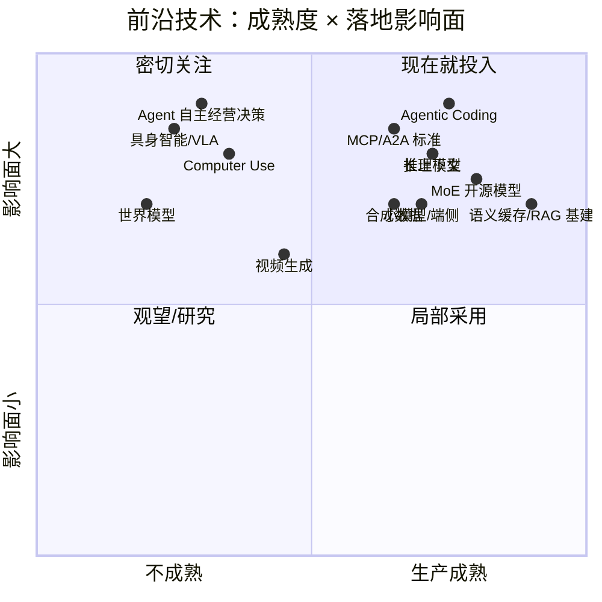
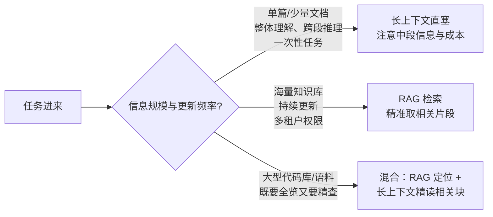
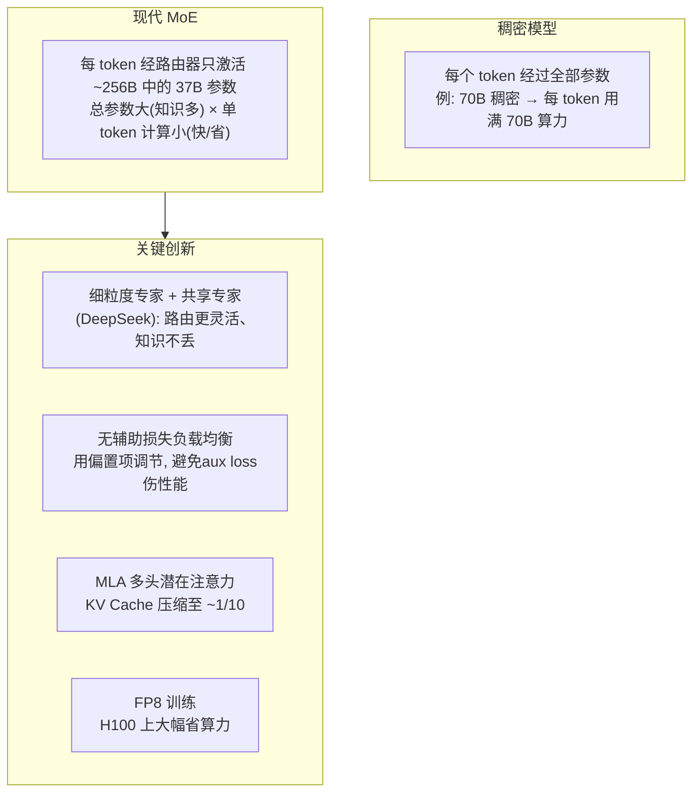
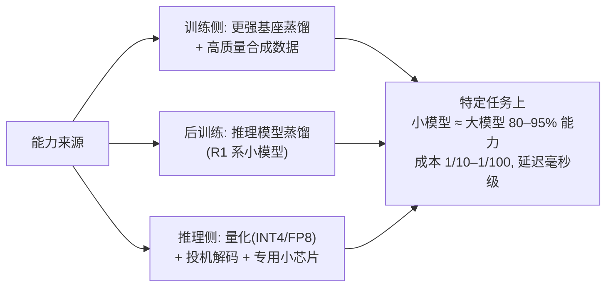
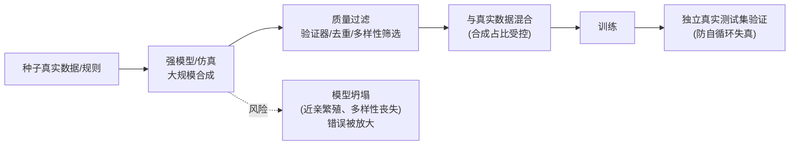
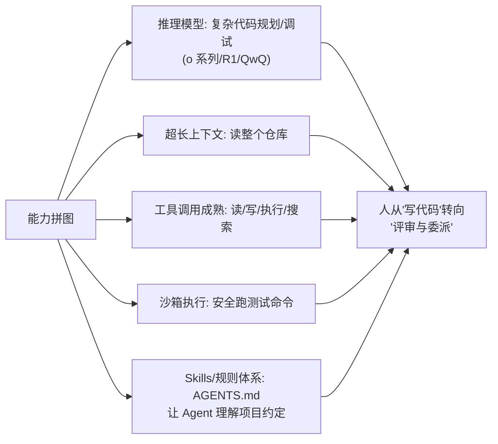
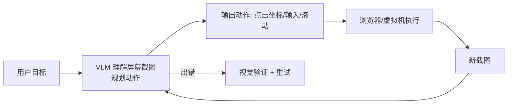
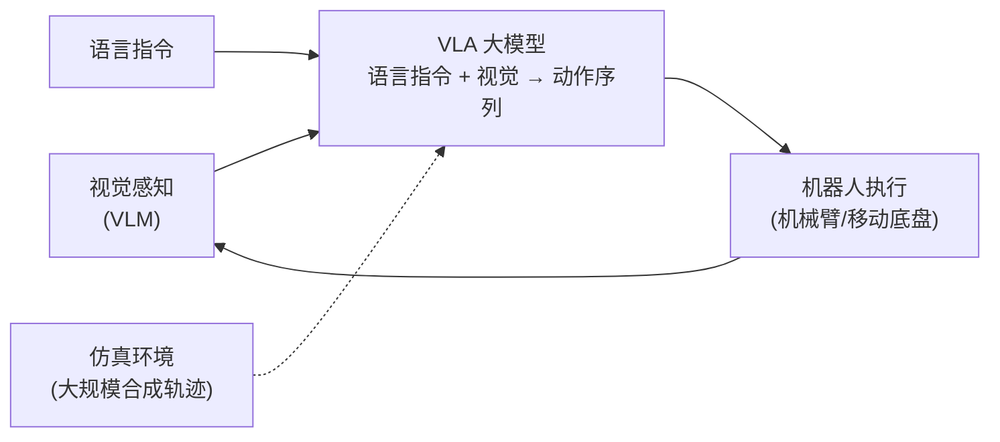

# 番外篇 Special-08：大模型前沿技术年报（2025–2026）

> 🔭 **站在浪潮正前方** —— 教程主体讲"稳定的核心知识"，本篇讲"正在发生的变化"：长上下文、MoE 架构创新、小模型与端侧、合成数据、智能体编程、多模态生成、世界模型与具身智能、开放生态。每个主题给出：发生了什么 → 原理速懂 → 工程含义 → 落地建议。

> 时间锚点：2026 年中。技术迭代极快，数字（上下文长度、价格、榜单）以官方最新为准，重点是**趋势与判断框架**。

---

## 学习目标

- [ ] 说清 2025–2026 年大模型的六条主线及其工程含义
- [ ] 理解长上下文的能力边界（"大海捞针"之外的真实难点）
- [ ] 讲清现代 MoE 的关键创新（细粒度专家、共享专家、MLA）及其成本逻辑
- [ ] 判断何时用小模型/端侧、何时用大模型
- [ ] 理解合成数据的正确用法与模型坍塌风险
- [ ] 了解 Agentic Coding、Computer Use、视频生成、世界模型/具身智能的进展与成熟度
- [ ] 用"成熟度 × 影响面"矩阵决定哪些前沿技术现在就该投入

---

## 📋 目录

1. [前沿地图与成熟度判断](#1-前沿地图与成熟度判断)
2. [长上下文：从 128K 到 1M+](#2-长上下文从-128k-到-1m)
3. [架构创新：现代 MoE 与注意力效率](#3-架构创新现代-moe-与注意力效率)
4. [小模型与端侧 AI](#4-小模型与端侧-ai)
5. [合成数据与数据工程前沿](#5-合成数据与数据工程前沿)
6. [Agentic Coding：软件开发范式转移](#6-agentic-coding软件开发范式转移)
7. [Computer Use 与 AI 浏览器](#7-computer-use-与-ai-浏览器)
8. [多模态生成：图像、视频与语音](#8-多模态生成图像视频与语音)
9. [世界模型与具身智能](#9-世界模型与具身智能)
10. [开放生态与标准化](#10-开放生态与标准化)
11. [落地决策与常见误区](#11-落地决策与常见误区)
12. [延伸阅读](#12-延伸阅读)

---

## 1. 前沿地图与成熟度判断

判断框架（别被发布会带节奏）：

- **能进生产的标准**：有明确成功指标、失败可兜底（HITL/回滚）、单位经济性为正、有 3 家以上可替代供应商。
- **技术成熟度信号**：开源复现出现、API 价格降到 1/10、云厂商托管服务上线、评测基准饱和/有防污染新基准。
- **警惕信号**：只有 demo 没有失败案例、只能特定环境运行、成本结构算不过账、评测口径不透明。

---

## 2. 长上下文：从 128K 到 1M+

### 发生了什么

主流模型上下文窗口从 2023 年的 8K/32K 一路涨到 128K、200K、1M，部分模型宣称 2M–10M token（整本小说、整个代码库、数百页论文一次塞入）。

### 为什么能做长

| 技术 | 作用 |
|------|------|
| RoPE 外推 / NTK-aware / YaRN | 位置编码外推到训练长度之外 |
| GQA/MQA、MLA | 压缩 KV Cache，否则长上下文显存爆炸 |
| KV Cache 量化/分页 | vLLM PagedAttention、FP8/INT4 KV |
| Ring/Context 并行 | 训练/推理时把超长序列切到多卡 |
| 长文本训练数据 | 增加长文档、长依赖任务的训练配比 |

### 工程现实（重要）

- **"塞得下" ≠ "用得好"**：长上下文存在"中间遗忘"（lost in the middle）——位于中部的信息检索准确率明显低于首尾；虽在改善但未消失。
- **成本随长度近似线性甚至更陡**：100 万 token 的输入费用与 KV Cache 显存都很可观；每次请求重新处理整个长文档是浪费。
- **长上下文不替代 RAG**：

落地建议：

- **前缀缓存必开**：长 system prompt/文档用 Prompt Caching，重复输入成本可降 50%–90%。
- **先 RAG 后长文**：从知识库检索出 top 20 片段（共 ~50K token）再让模型精读，比盲塞 1M 更准更便宜。
- **关键信息放首尾**、给长文档加结构化目录/摘要索引。
- 评测用"大海捞针 + 多跳推理 + 全局摘要"三类，别只测 needle-in-a-haystack。

---

## 3. 架构创新：现代 MoE 与注意力效率

### 3.1 MoE 成为开源主流

2024–2026 的共识：**稠密模型止步，MoE 接棒**。DeepSeek-V3、Mixtral、Qwen-MoE、DBRX、Grok 等均为 MoE。

要点：

- **激活参数量 ≠ 总参数量**：MoE 的"671B 总参数"每 token 只激活约 37B；推理成本看激活参数 + 专家分布的显存（所有专家都要在显存里）。
- **MoE 推理的特殊挑战**：专家并行 all-to-all 通信、负载不均导致的尾延迟、显存占用按总参数量算（单机放不下需多卡）——云 API 化之后这些由厂商解决，自托管需谨慎。
- **MLA（多头潜在注意力）**：DeepSeek 提出的 KV 压缩，把 KV Cache 压到约 1/10，对长上下文 + 高并发推理价值极大，已被多家跟进。

### 3.2 注意力效率与线性注意力

- O(n²) 注意力在超长序列上仍是瓶颈；研究方向：稀疏注意力、滑动窗口（Mistral）、线性/循环注意力（Mamba 类 SSM 状态空间模型）。
- 现状（2026）：**纯线性注意力尚未在通用大模型上完全取代 softmax 注意力**，但混合架构（注意力 + 循环层）、稀疏化在长上下文场景持续渗透。工程上更常见的是"架构优化 + KV 压缩 + 前缀缓存"组合拳。

---

## 4. 小模型与端侧 AI

### 发生了什么

7B/14B 乃至 1B–4B 模型在**特定任务**上追平两年前的大模型：Phi 系列、Qwen 小尺寸、Llama 轻量、Gemma、MiniCPM 等；手机/PC NPU 上本地跑 7B–70B 量化模型成为现实（Apple Intelligence、高通/联发科 NPU、AI PC）。

### 为什么小模型重新重要

工程决策矩阵：

| 场景 | 推荐 |
|------|------|
| 高并发分类/抽取/打标/意图识别 | 小模型（甚至百 MB 级），批处理 |
| 隐私敏感、不能出网 | 端侧/私有化小模型 |
| 需要毫秒级响应（实时语音、自动补全） | 端侧/边缘小模型 |
| 开放式复杂推理、创作、长程规划 | 大模型/推理模型 |
| 不确定难度的流量入口 | 路由：小模型先试，置信度低再升级大模型 |

**级联路由（Model Cascade）** 是成本优化的核心模式：便宜小模型兜底 80% 简单请求，难请求逐级升级 —— 平均成本可降 5–20 倍，见 [Special-06 模型路由](special-06-agent-platform-architecture.md)。

---

## 5. 合成数据与数据工程前沿

### 5.1 合成数据成为主流"燃料"

真实人类互联网数据接近被爬尽且质量参差，合成数据（模型生成、规则生成、仿真生成）占比快速上升：

- **指令/偏好数据**：Self-Instruct、Evol-Instruct（让强模型把简单问题演化成难问题）、用强模型生成 + 自动过滤。
- **推理轨迹**：推理模型生成的长 CoT 数据蒸馏小模型（见 Special-07）。
- **多模态**：文生图模型反哺视觉训练数据、仿真环境生成具身智能轨迹。
- **代码**：从开源代码 + Agent 自改自测生成训练数据。

### 5.2 正确姿势与风险

- **可验证性是金标准**：代码（能跑测试）、数学（答案可判）、结构化（schema 可校验）的合成数据最可靠。
- **多样性靠种子与温度**：单一模型合成容易"模式收敛"，用多模型、多提示、高温度 + 去重。
- **保留真实数据锚点**：真实分布数据是防止坍塌的锚；测试集必须是真实的、未被合成污染。
- **数据配比成为核心机密**：合成什么、合成多少、怎么过滤，是模型团队的 know-how 核心。

---

## 6. Agentic Coding：软件开发范式转移

### 发生了什么

2025 年是"智能体编程"元年：GitHub Copilot 式的**行内补全**（人主导、AI 补几行）演进为**任务委派**（人说目标，Agent 自主读代码库、改文件、跑测试、提 PR）。代表：Claude Code、OpenAI Codex CLI、Cursor Agent、Devin、通义灵码/Qwen Code 等。

### 为什么现在成立

工程要点（也是企业落地要点）：

- **验证闭环是关键**：Agent 编程能成立的本质是"代码对不对可以跑测试验证"（RLVR 思想）——有测试的仓库 Agent 能力上限高得多。**投资测试就是投资 Agent 生产力**。
- **上下文工程 > 提示词**：仓库约定（AGENTS.md/CLAUDE.md）、相关文件检索、命令输出截断策略，决定 Agent 表现。
- **人机分工**：Agent 擅长样板代码、批量重构、写测试、跨文件修改、依赖升级；人负责架构决策、模糊需求、最终评审。
- **风险**：幻觉 API、看似合理的错误实现、大规模错误改动；对策是小步提交、强制 review、CI 门禁、权限隔离（Agent 不能直推主干）。
- **组织影响**："10x 工程师"杠杆放大；初级工程师的成长路径被重塑（从写样板到评审 AI 产出）。

落地成熟度：**已进入生产**（2026 年大量工程团队日常使用），是当前 ROI 最确定的 Agent 场景之一。

---

## 7. Computer Use 与 AI 浏览器

### 发生了什么

Agent 不再只调结构化 API，而是像人一样**看屏幕、点按钮、填表单**：Claude Computer Use、OpenAI Operator/ChatGPT Agent、字节/谷歌的浏览器 Agent、各类 AI 浏览器（Comet 等）。

### 原理与现状

- **本质**：把 GUI 像素/无障碍树当作"通用工具接口"，好处是能操作**任何**没有 API 的老系统；代价是慢、贵、脆弱。
- **成熟度（2026）**：**演示惊艳，可靠性仍有限**——适合流程固定、容错高的任务（填表、比价、信息收集、简单后台操作），复杂/高价值任务仍需人盯。RPA 的 AI 原生升级，但尚未全面替代 RPA。
- 工程建议：优先用 MCP/API 等结构化工具；Computer Use 用于"没有 API 且不值得建 API"的长尾系统；必须配合人工确认点与操作审计。

---

## 8. 多模态生成：图像、视频与语音

| 方向 | 代表 | 2026 状态 | 工程要点 |
|------|------|----------|---------|
| 文生图 | FLUX、SD 系列、DALL·E、即梦/可灵图像 | **生产成熟**，营销/电商/设计已规模化 | 风格一致性（LoRA/参考图）、文字渲染、版权合规 |
| 图生图/编辑 | 局部重绘、风格迁移、商品图 | 生产可用 | 蒙版控制、身份一致性 |
| 文生视频 | Sora、可灵、即梦、Veo、Runway | **快速成熟，成本仍高** | 时长/一致性/物理合理性；秒级成本高，适合短片广告 |
| 语音对话 | GPT-4o 实时语音、端到端 TTS/ASR | 生产可用，延迟仍是体验关键 | 全双工、打断、情感；端侧小模型趋势 |
| 音乐/音频 | 歌曲生成、音效 | 局部生产 | 版权与时长 |

架构认知：

- 现代生成基于**扩散模型**（图像/视频）与 **DiT（Diffusion Transformer）**；视频 = 高维时序扩散，算力与数据是门槛。
- **Omni（全模态）模型**是方向：原生理解与生成文/图/音/视频（Gemini/GPT-4o 类），而非拼装管线。
- 内容溯源（水印、C2PA）与版权是企业落地必答题。

---

## 9. 世界模型与具身智能

> 这是离生产最远但想象空间最大的方向，了解趋势即可。

- **世界模型（World Model）**：学习"环境如何随动作变化"，能预测行动后果（LeCun 的 JEPA 路线、视频生成被视为世界模型的雏形）。目标是让 AI 具备"因果直觉"而非只会统计相关性。
- **具身智能（Embodied AI）/ VLA**：视觉-语言-动作模型（Vision-Language-Action）把大模型接入机器人身体：RT-2、π0（Physical Intelligence）、GR00T（NVIDIA）、Figure/特斯拉 Optimus 的软件栈。

- 核心瓶颈：**真实世界数据稀缺**（机器人不能像文本一样爬互联网）→ 靠仿真合成 + 遥操作 + 动作学习；长尾物理场景泛化差。
- 判断：长期（5 年+）可能是比聊天更大的市场，但 2026 年仍处早期，应用开发者只需关注其对仿真/3D/边缘推理的外溢技术。

---

## 10. 开放生态与标准化

2025–2026 的另一条主线是**从封闭竞赛走向标准互联**（详见 [Special-06 第 8 节](special-06-agent-platform-architecture.md)）：

- **开放权重模型**持续逼近闭源：Qwen、DeepSeek、LLaMA、Mistral 等使"自托管 + 微调"成为主流选项，改变议价结构。
- **MCP** 成为工具接入事实标准（Streamable HTTP、OAuth 2.1、Registry）；**A2A** 推动 Agent 互联；**AGENTS.md** 等环境约定标准化。
- **推理模型开放**（R1 系）把高级推理能力民主化。
- 工程含义：**避免锁定私有协议**，工具 MCP 化、模型可替换、数据可迁移，是这一时期架构设计的默认原则。

---

## 11. 落地决策与常见误区

### 现在该投入什么（2026）

| 优先级 | 投入 | 理由 |
|--------|------|------|
| ⭐⭐⭐ | Agentic Coding 工具链 + 测试基建 | ROI 最确定，直接提升工程团队产能 |
| ⭐⭐⭐ | 模型路由（小模型级联 + 推理模型兜底）+ 缓存 | 成本立降，无新风险 |
| ⭐⭐⭐ | MCP 化工具接入 | 生态方向，晚接入有迁移成本 |
| ⭐⭐ | 推理模型用于复杂规划/代码/分析 | 任务成功率显著提升，按难度路由控成本 |
| ⭐⭐ | RAG + 长上下文混合架构 | 长文理解场景成熟 |
| ⭐⭐ | 合成数据管线（可验证优先） | 降低微调数据成本 |
| ⭐ | 视频生成/Computer Use | 按业务场景试点，预期失败兜底 |
| 观望 | 世界模型、VLA 具身 | 离应用生产尚远 |

### 常见误区

- **追长上下文数字**：1M 窗口塞全库，又贵又有中段遗忘；RAG+缓存的混合架构往往更优。
- **参数迷信**：MoE"671B"不代表每 token 用 671B；自托管要看激活参数和专家显存。
- **小模型不够用的偏见**：蒸馏小模型在窄任务上常够用，成本差 100 倍。
- **合成数据无脑用**：无验证、无真实锚点会坍塌；测试集必须真实。
- **Computer Use 当 RPA 全面替代**：可靠性未到，高价值流程不能裸奔。
- **忽视验证闭环就上 Agent**：代码 Agent 的上限由测试覆盖率决定；业务 Agent 的上限由评测与 HITL 决定。

---

## 12. 延伸阅读

- DeepSeek-V3 / R1 技术报告（MoE、MLA、FP8、GRPO）
- 各厂商长上下文技术博客（RoPE 外推、YaRN、MLA）
- Mamba/状态空间模型论文、混合架构进展
- 推理模型：见 [Special-07](special-07-reasoning-models.md)
- 智能体平台与标准：见 [Special-06](special-06-agent-platform-architecture.md)
- 术语速查：[术语表](../GLOSSARY.md)

---

[← 返回番外篇目录](README.md) | [返回教程主目录](../../README.md)
