# 番外篇 Special-09：核心概念图解 —— 20 张图讲透大模型

> 🖼️ **一图胜千言** —— 本篇用 20 张示意图把大模型最容易"似懂非懂"的核心概念画出来，每张图配极简讲解。适合：初学建立直觉、复习串讲、面试前热身。概念定义见 [术语表](../GLOSSARY.md)，本篇只做"可视化理解"。

---

## 学习目标

- [ ] 在脑中建立"文本 → token → 向量 → 注意力 → 概率 → 生成"的完整数据流
- [ ] 用图解释 Transformer、KV Cache、MoE、LoRA、量化、RLHF 等机制
- [ ] 用图讲清 RAG、Agent Loop、MCP、模型路由等系统如何运转

---

## 图 1：文本如何变成模型输入（Tokenization）

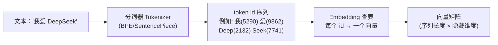

**直觉**：模型不认识字，只认识数字。分词器把文本切成 subword（兼顾生僻词与词表大小），再查 embedding 表变成向量。token 也是计费和上下文长度的单位。

---

## 图 2：Embedding 向量空间（语义 = 位置）

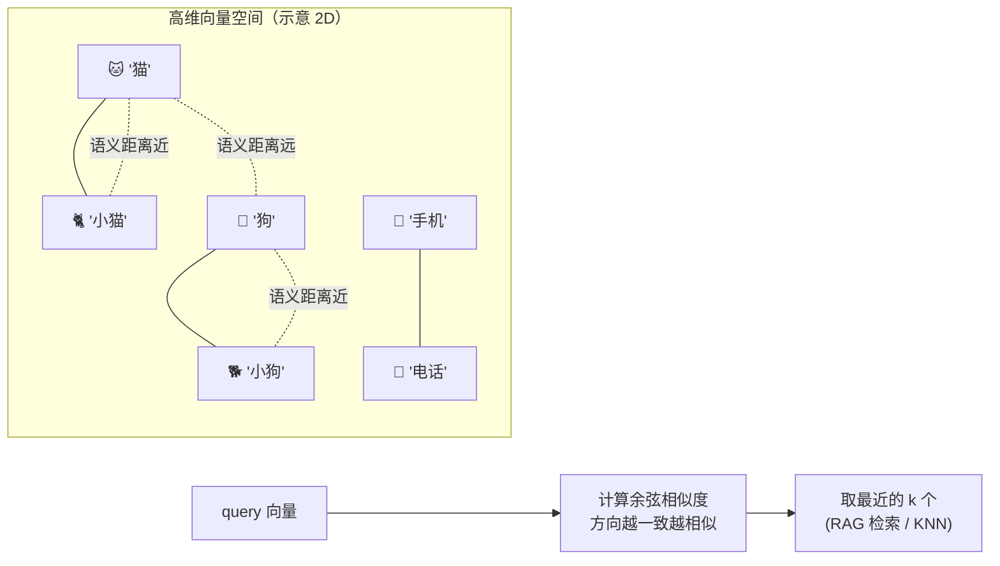

**直觉**：embedding 把"语义"编码成向量方向——语义近的词/句子在空间里聚在一起。RAG 检索就是在这个空间里找"离问题最近的知识"。

---

## 图 3：一个 Transformer Block（大模型的"千层"重复单元）

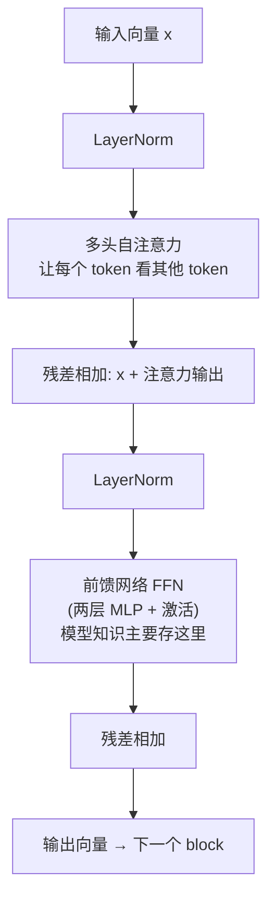

**直觉**：大模型 = 几十个这样的 block 叠起来。注意力负责"信息流动"（token 之间交换信息），FFN 负责"思考与记忆"（变换、存储知识）。残差连接让深层网络可训练。

---

## 图 4：注意力机制（Q-K-V，像查字典）

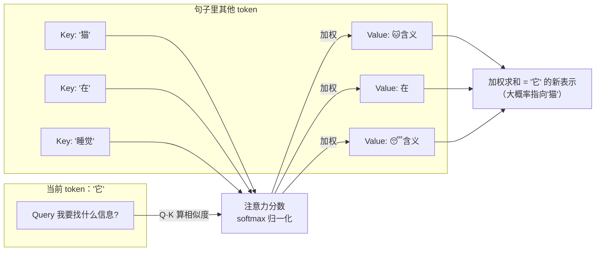

**直觉**：每个词发出一个 Query（我想知道什么），其他词亮出 Key（我是什么），Q·K 越匹配权重越高，再按权重取它们的 Value（实际内容）。多头 = 多组并行关注不同关系（语法/指代/语义）。

---

## 图 5：自回归生成 + KV Cache（为什么越生成越"占显存"）

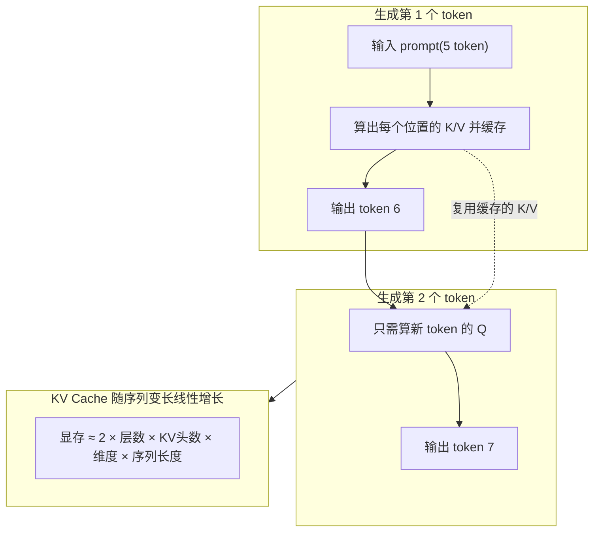

**直觉**：没有 KV Cache，每生成一个 token 都要重算整句（浪费）；有了缓存，历史 token 的 K/V 只算一次。代价是缓存随对话变长而膨胀——这是长上下文和高并发推理的显存瓶颈，也是 GQA/MLA/量化要压缩它的原因。

---

## 图 6：大模型养成三阶段（预训练 → SFT → 对齐）

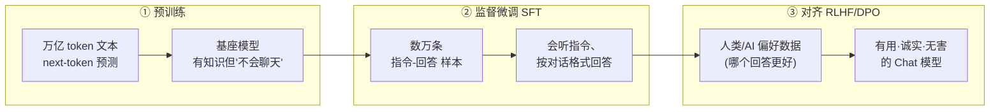

**直觉**：预训练让模型"读书"学知识（无标签）；SFT 教它"怎么答题"（模仿示范）；对齐教它"怎么答得让人满意、不闯祸"（偏好优化）。

---

## 图 7：RLHF vs DPO（两条对齐路线）

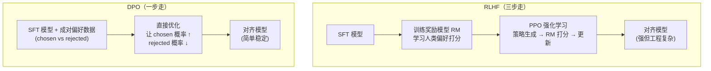

**直觉**：RLHF 先训一个"评委"（奖励模型）再用 RL 反复考试；DPO 跳过评委，直接从"好答案/坏答案"成对数据中学。工程上 DPO 简单，效果上 RLHF 上限常被认为更高，二者都常用。

---

## 图 8：LoRA（不动大模型，挂个"小补丁"）

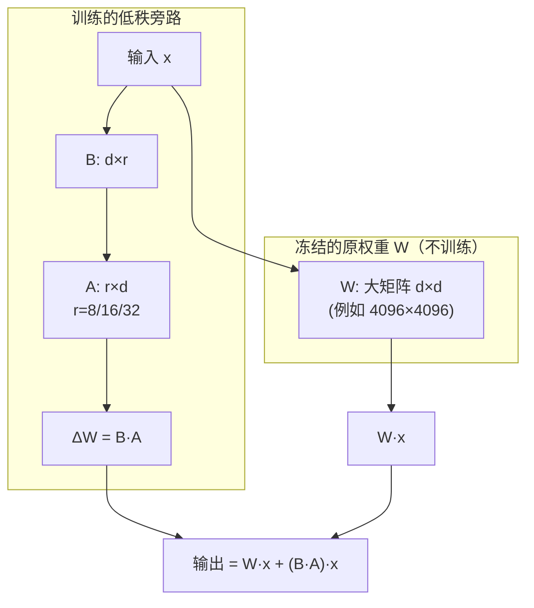

**直觉**：微调引起的权重变化是"低秩"的（信息维度低），用两个瘦长矩阵 B·A 就能表达。可训练参数降数百倍；推理时可把 `B·A` 合并回 W，零额外延迟。QLoRA 进一步把 W 量化到 4bit 省显存。

---

## 图 9：量化（用更"粗"的数字存权重）

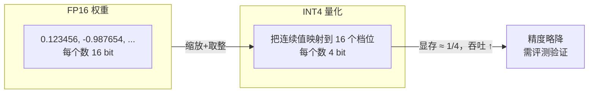

**直觉**：权重不需要无限精度，把 16bit 浮点压到 8bit/4bit 整数，显存大降、速度大升，代价是微小精度损失。GPTQ/AWQ（训练后量化）、SmoothQuant（激活量化）、FP8（新硬件原生）是常见方案。

---

## 图 10：MoE（混合专家：很多专家，但每次只问几个）

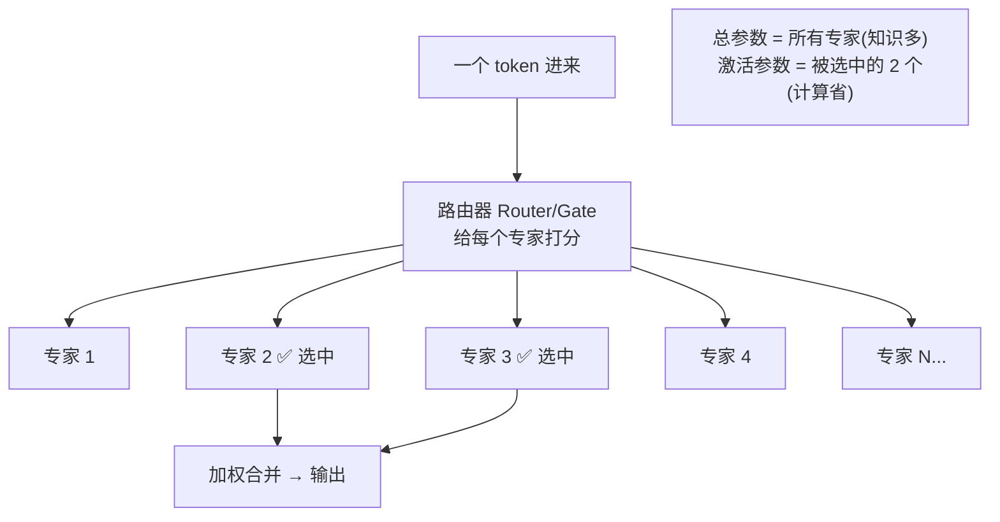

**直觉**：像医院分诊——有很多专科医生（专家 FFN），路由器根据病人（token）决定送哪 2 位。模型总知识量大（所有专家都在显存），但每个 token 只过少数专家，计算便宜。

---

## 图 11：三种分布式并行（切数据 / 切层内 / 切层）

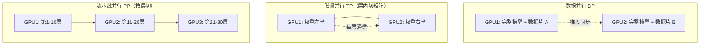

**直觉**：DP 是"多个人做同一套卷子的不同题"；TP 是"一层的大矩阵拆给多张卡一起算"（通信多，放同一台机器）；PP 是"流水线接力，每人负责几层"（通信少，可跨机器）。大模型训练三者组合（3D 并行）。

---

## 图 12：思维链（CoT）：把"心算"写出来

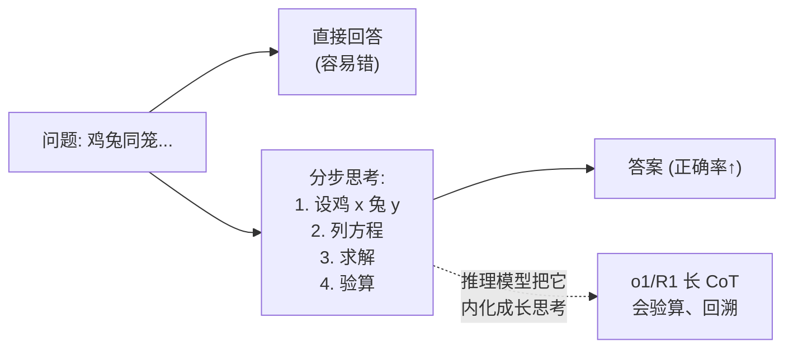

**直觉**：模型每生成一个 token 都是一次"前向计算"，把推理步骤写出来等于给它更多串行计算预算。复杂题"多想几步"正确率显著提升；推理模型靠 RL 把这种思考行为训练成自发能力。

---

## 图 13：RAG（先查资料，再回答）

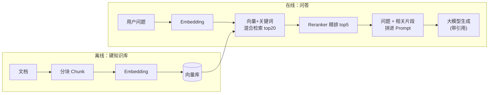

**直觉**：开卷考试——不要求模型背下所有知识，而是先检索出相关资料再让它"照着资料答"。解决知识过时、幻觉、私有数据接入三大问题；引用来源让答案可核验。

---

## 图 14：Agent Loop（感知-思考-行动-观察的循环）

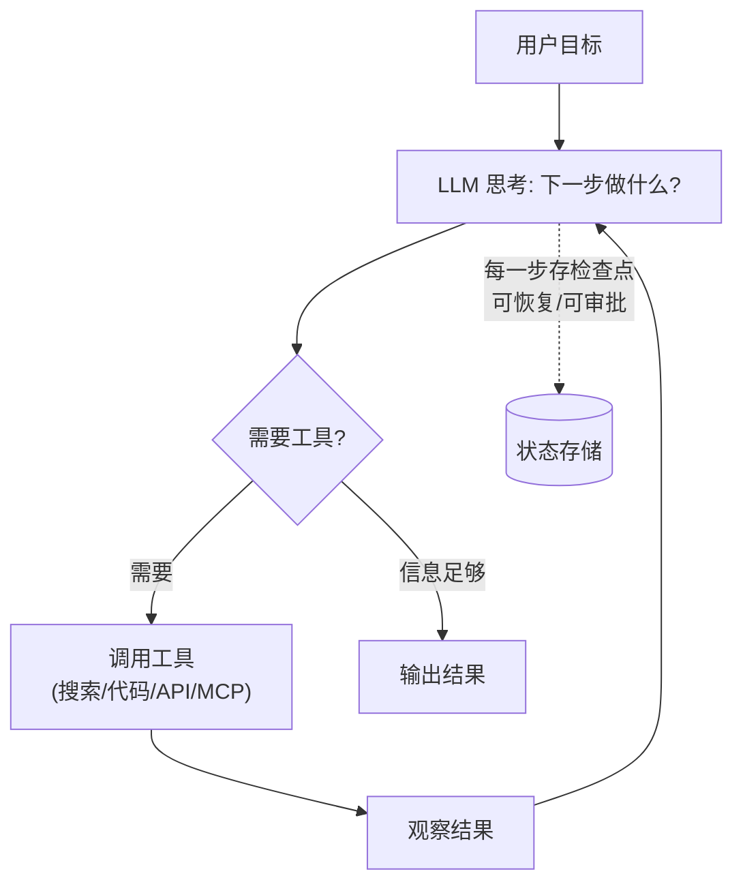

**直觉**：普通聊天是"一问一答"；Agent 是"给个目标，模型自己决定调什么工具、看结果、再决定下一步"，直到完成。工程关键：工具能力、记忆、检查点（崩溃可恢复）、预算护栏（防死循环）、人机审批（防闯祸）。

---

## 图 15：MCP（Agent 接工具的"USB-C 接口"）

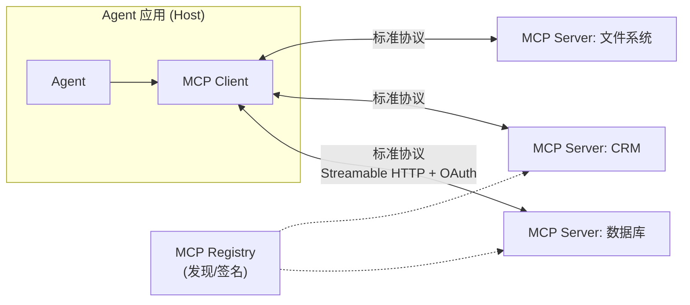

**直觉**：没有 MCP，每接一个工具都要写一套定制对接（N×M 噩梦）；有了 MCP，任何 Agent 都能即插即用任何 MCP Server，就像 USB 统一了外设接口。MCP 管"Agent 连工具"，A2A 管"Agent 连 Agent"。

---

## 图 16：模型级联路由（便宜模型先上，难题升级）

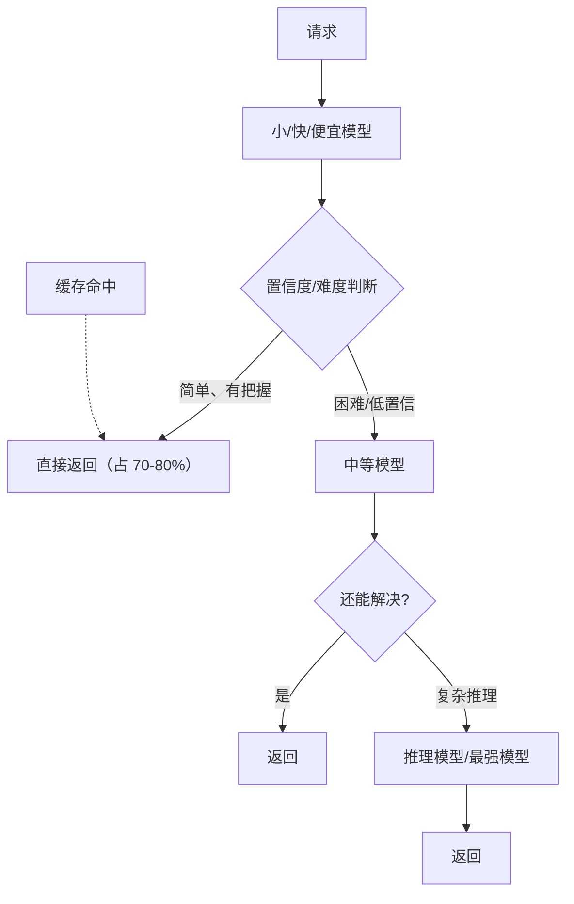

**直觉**：像医院分级诊疗——小病在社区（小模型，几分钱），大病转专科（大模型），疑难杂症请专家（推理模型）。平均成本可降 5–20 倍而质量几乎不变。配合缓存、prompt caching 效果叠加。

---

## 图 17：vLLM 连续批处理（GPU 像餐厅翻台）

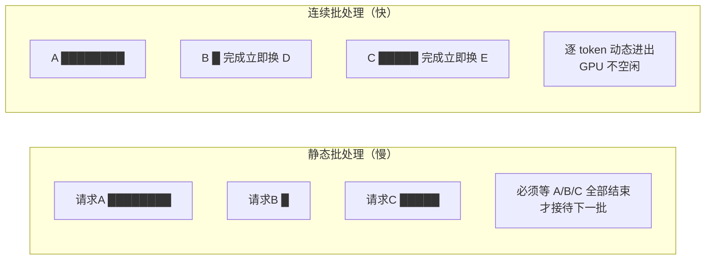

**直觉**：静态批处理像包车，要等所有人到齐才走；连续批处理（continuous batching）像餐厅翻台，谁吃完谁走、立刻补新客人。配合 PagedAttention 像操作系统一样分页管理 KV Cache 显存，吞吐提升数倍。

---

## 图 18：智能体评估（不只看"答得对不对"，看"任务完没完成"）

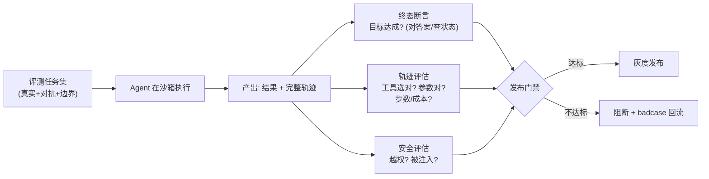

**直觉**：传统模型评"答题分"；Agent 要在沙箱里真跑，评"目标达成没、工具用对没、有没有闯祸"。Eval 是 Agent 的单元测试，prompt/工具变更都要过门禁。

---

## 图 19：HITL 与持久化执行（等人审批，但不占着机器）

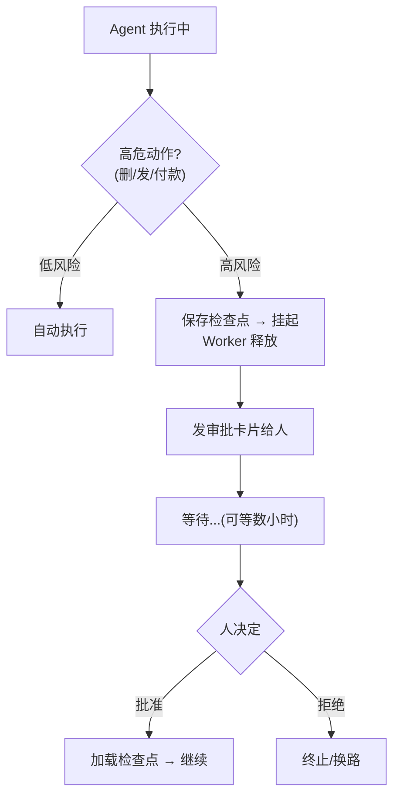

**直觉**：人可能 3 小时后才审批，系统不能干等。把任务状态存下来、释放计算资源，审批结果回来再"断点续跑"。这就是 Durable Execution——Agent 可随时崩溃、暂停、恢复。

---

## 图 20：测试时计算光谱（多想的 N 种方式）

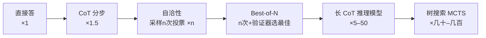

**直觉**："想得更久"有两种维度——**宽度**（多想几个方案再选：自洽性/Best-of-N/树搜索）和**深度**（一条路想到底、中途验算回溯：长 CoT）。越往后越强也越贵，按任务难度选择，是推理模型时代的成本-质量调度核心。

---

## 小结：一张图串起整个大模型数据流

```mermaid
flowchart LR
    TXT["文本"] -->|分词/embedding| TRANS["Transformer 堆叠<br/>(注意力+FFN)"]
    TRANS -->|预训练+SFT+对齐| MODEL["大模型"]
    MODEL -->|API| APP["应用"]
    APP -->|知识接地| RAG["RAG 检索"]
    APP -->|采取行动| AGENT["Agent + 工具(MCP)"]
    APP -->|按难度调度| ROUTE["模型路由<br/>小模型→推理模型"]
    APP -->|质量保证| EVAL["评测 + HITL + 护栏"]
    RAG & AGENT --> INFRA["推理服务<br/>vLLM/KV缓存/量化"]
```

记住这条主线：**文本变向量 → Transformer 算注意力 → 预训练学知识、对齐学做人 → 应用层靠 RAG 接地、靠 Agent 行动、靠路由省钱、靠评测和护栏兜底**。

---

## 延伸阅读

- 每个概念的完整定义：[术语表](../GLOSSARY.md)
- 平台与系统全景：[Special-06 智能体平台架构](special-06-agent-platform-architecture.md)
- 图 20 深入：[Special-07 推理模型与测试时计算](special-07-reasoning-models.md)
- 技术选型落地：[Special-03 技术选型手册](special-03-tech-selection.md)

---

[← 返回番外篇目录](README.md) | [返回教程主目录](../../README.md)
